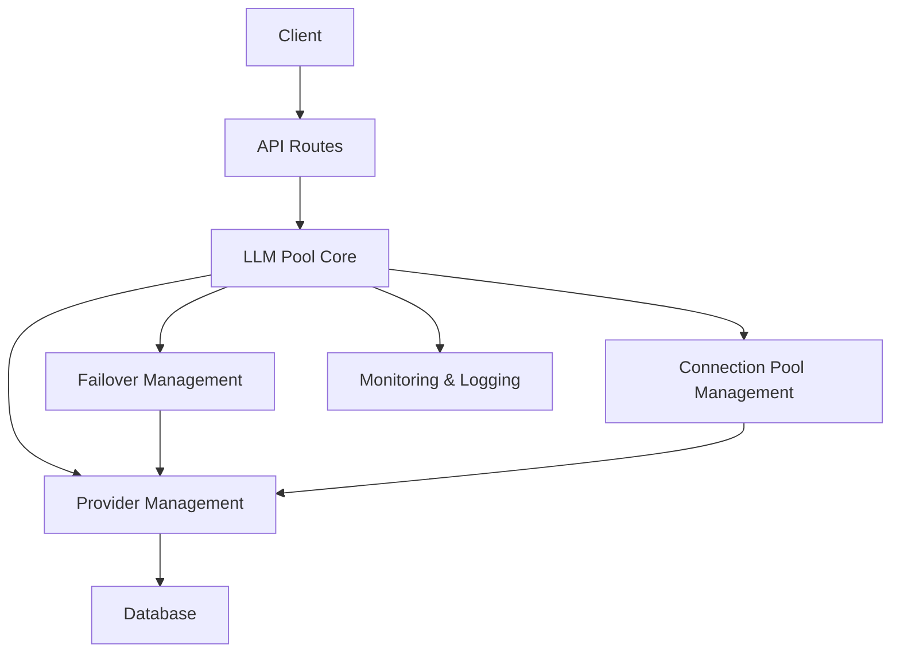

# LLM Pool Development Document

## 1. Project Overview

### 1.1 Project Background
The current LLM pool has several functional deficiencies, including connection pool management, error handling, quota management, monitoring and logging issues, which need to be comprehensively improved to meet the core expected effects.

### 1.2 Core Expected Effects
- Support configuring multiple large model API Keys and providing a unified calling interface
- When a Key's quota is exhausted, rate-limited, or fails to call, automatically switch to the next available Key to ensure the request is completed normally

### 1.3 Technology Stack
- Frontend: Next.js 14+
- Backend: Node.js
- Database: SQLite/MySQL
- ORM: Prisma
- Large model interface: OpenAI SDK

## 2. System Architecture

### 2.1 Overall Architecture


### 2.2 Module Division

| Module | Responsibility | File Location |
|--------|---------------|---------------|
| API Routes | Handle client requests | src/app/api/ |
| LLM Pool Core | Core business logic | src/lib/llmPool.ts |
| Connection Pool Management | Manage OpenAI client connections | src/lib/connectionPool.ts |
| Monitoring & Logging | Monitor system status and record logs | src/lib/monitoring.ts |
| Security Management | Handle security-related functions | src/lib/security.ts |
| Prisma Client | Database operations | src/lib/prisma.ts |

## 3. Core Function Implementation

### 3.1 Multi-Key Configuration and Unified Interface

#### 3.1.1 Data Model
```prisma
model LlmApiProvider {
  id             String   @id @default(cuid())
  name           String   @unique
  apiKey         String
  baseUrl        String   @default("https://api.openai.com/v1")
  model          String   @default("gpt-4o-mini")
  priority       Int      @default(0)
  isActive       Boolean  @default(true)
  quotaRemaining Int?
  quotaUsed      Int      @default(0)
  lastUsedAt     DateTime?
  lastError      String?
  lastErrorAt    DateTime?
  createdAt      DateTime @default(now())
  updatedAt      DateTime @updatedAt

  @@index([isActive, priority])
}
```

#### 3.1.2 Unified API Interface
```typescript
// src/app/api/llm/route.ts
export async function POST(req: NextRequest) {
  try {
    const body = await req.json();
    const { model, messages, temperature, max_tokens } = body;
    
    const candidates = await getProviderCandidates();
    if (candidates.length === 0) {
      return NextResponse.json({ error: 'No available providers' }, { status: 503 });
    }

    const result = await withLlmFailover(
      candidates,
      async (client, model, sel) => {
        const completion = await client.chat.completions.create({
          model,
          messages,
          temperature,
          max_tokens,
        });
        return completion;
      },
      1 // Quota consumption
    );

    return NextResponse.json(result);
  } catch (error) {
    return NextResponse.json({ error: error.message }, { status: 500 });
  }
}
```

### 3.2 Automatic Failover

#### 3.2.1 Fault Detection and Handling
```typescript
// src/lib/llmPool.ts
export async function withLlmFailover<T>(
  candidates: ProviderSelection[],
  fn: (client: OpenAI, model: string, sel: ProviderSelection) => Promise<T>,
  quotaCost: number
): Promise<T> {
  if (candidates.length === 0) {
    throw new Error(API_QUOTA_EXHAUSTED_MESSAGE);
  }

  let lastErr: any = null;
  for (const sel of candidates) {
    if (sel.kind === 'db') {
      if (!(sel.provider.quotaRemaining === null || sel.provider.quotaRemaining > 0)) continue;
    }

    try {
      const { client, model } = await createOpenAiClient(sel);
      const result = await fn(client, model, sel);
      if (sel.kind === 'db') {
        await noteProviderUsed(sel.provider.id, quotaCost);
      }
      return result;
    } catch (err: any) {
      lastErr = err;
      if (sel.kind === 'db') {
        if (isQuotaError(err)) {
          await markProviderQuotaExhausted(sel.provider.id, String(err?.message || 'quota exhausted'));
        } else if (isRateLimitError(err)) {
          await markProviderError(sel.provider.id, String(err?.message || 'rate limit exceeded'));
        } else if (isConnectionError(err)) {
          await markProviderError(sel.provider.id, String(err?.message || 'connection error'));
        } else {
          await markProviderError(sel.provider.id, String(err?.message || 'error'));
        }
      }
      continue;
    }
  }

  if (lastErr && isQuotaError(lastErr)) {
    throw new Error(API_QUOTA_EXHAUSTED_MESSAGE);
  }

  throw lastErr || new Error('LLM request failed');
}
```

#### 3.2.2 Error Classification
```typescript
// src/lib/llmPool.ts
export function isQuotaError(err: any): boolean {
  const status = err?.status ?? err?.response?.status;
  const message = String(err?.message || '');
  return (
    status === 402 ||
    status === 429 ||
    /insufficient[_ ]quota/i.test(message) ||
    /quota/i.test(message) ||
    /浣欓涓嶈冻|棰濆害|閰嶉|璧勬簮涓嶈冻/.test(message)
  );
}

export function isRateLimitError(err: any): boolean {
  const status = err?.status ?? err?.response?.status;
  const message = String(err?.message || '');
  return (
    status === 429 ||
    /rate[_ ]limit/i.test(message) ||
    /too[_ ]many[_ ]requests/i.test(message)
  );
}

export function isConnectionError(err: any): boolean {
  const message = String(err?.message || '');
  return (
    /connection/i.test(message) ||
    /timeout/i.test(message) ||
    /network/i.test(message)
  );
}
```

### 3.3 Connection Pool Management

#### 3.3.1 Connection Pool Implementation
```typescript
// src/lib/connectionPool.ts
class ConnectionPool {
  private pool: Map<string, OpenAI> = new Map();
  private maxConnections = 10;

  getClient(apiKey: string, baseUrl: string): OpenAI {
    const key = `${apiKey}:${baseUrl}`;
    if (this.pool.has(key)) {
      return this.pool.get(key)!;
    }

    if (this.pool.size >= this.maxConnections) {
      // Remove the oldest connection
      const oldestKey = this.pool.keys().next().value;
      this.pool.delete(oldestKey);
    }

    const client = new OpenAI({ apiKey, baseURL: baseUrl });
    this.pool.set(key, client);
    return client;
  }

  clear() {
    this.pool.clear();
  }
}

export const connectionPool = new ConnectionPool();
```

#### 3.3.2 Integration into Existing Code
```typescript
// src/lib/llmPool.ts
export async function createOpenAiClient(sel: ProviderSelection): Promise<{ client: OpenAI; model: string }> {
  const provider = sel.provider;
  const baseURL = normalizeBaseUrl((provider as any).baseUrl);
  const apiKey = (provider as any).apiKey;
  const model = (provider as any).model;
  // Use connection pool to get client
  const client = connectionPool.getClient(apiKey, baseURL);
  return { client, model };
}
```

### 3.4 Quota Management

#### 3.4.1 Quota Calculation and Management
```typescript
// src/lib/llmPool.ts
export async function noteProviderUsed(providerId: string, decrementQuotaBy: number): Promise<void> {
  await ensureProviderTable();
  const now = new Date().toISOString();

  // quotaRemaining NULL means unlimited.
  await prisma.$executeRaw(
    Prisma.sql`
      UPDATE LlmApiProvider
      SET
        quotaUsed = quotaUsed + ${decrementQuotaBy},
        quotaRemaining = CASE
          WHEN quotaRemaining IS NULL THEN NULL
          ELSE MAX(quotaRemaining - ${decrementQuotaBy}, 0)
        END,
        lastUsedAt = ${now},
        updatedAt = ${now}
      WHERE id = ${providerId}
    `
  );
}

export async function checkQuotaThresholds(): Promise<void> {
  const providers = await getActiveLlmProviders();
  for (const provider of providers) {
    if (provider.quotaRemaining !== null && provider.quotaRemaining < 100) {
      // Send quota warning notification
      await sendQuotaWarning(provider.id, provider.name, provider.quotaRemaining);
    }
  }
}
```

### 3.5 Monitoring and Logging

#### 3.5.1 Monitoring System
```typescript
// src/lib/monitoring.ts
class MonitoringService {
  private metrics: Map<string, any> = new Map();

  recordRequest(providerId: string, duration: number, success: boolean, error?: string) {
    const key = `provider:${providerId}`;
    if (!this.metrics.has(key)) {
      this.metrics.set(key, {
        totalRequests: 0,
        successfulRequests: 0,
        failedRequests: 0,
        totalDuration: 0,
        lastRequestAt: new Date(),
        errors: new Map<string, number>(),
      });
    }

    const metric = this.metrics.get(key);
    metric.totalRequests++;
    if (success) {
      metric.successfulRequests++;
    } else {
      metric.failedRequests++;
      if (error) {
        const errorCount = metric.errors.get(error) || 0;
        metric.errors.set(error, errorCount + 1);
      }
    }
    metric.totalDuration += duration;
    metric.lastRequestAt = new Date();
  }

  getMetrics() {
    return Object.fromEntries(this.metrics);
  }

  getProviderStats(providerId: string) {
    const key = `provider:${providerId}`;
    return this.metrics.get(key);
  }
}

export const monitoringService = new MonitoringService();
```

#### 3.5.2 Integration into Existing Code
```typescript
// src/lib/llmPool.ts
export async function withLlmFailover<T>(
  candidates: ProviderSelection[],
  fn: (client: OpenAI, model: string, sel: ProviderSelection) => Promise<T>,
  quotaCost: number
): Promise<T> {
  if (candidates.length === 0) {
    throw new Error(API_QUOTA_EXHAUSTED_MESSAGE);
  }

  let lastErr: any = null;
  for (const sel of candidates) {
    if (sel.kind === 'db') {
      if (!(sel.provider.quotaRemaining === null || sel.provider.quotaRemaining > 0)) continue;
    }

    const startTime = Date.now();
    try {
      const { client, model } = await createOpenAiClient(sel);
      const result = await fn(client, model, sel);
      const duration = Date.now() - startTime;
      
      // Record monitoring data
      monitoringService.recordRequest(
        sel.kind === 'db' ? sel.provider.id : 'legacy',
        duration,
        true
      );
      
      if (sel.kind === 'db') {
        await noteProviderUsed(sel.provider.id, quotaCost);
      }
      return result;
    } catch (err: any) {
      const duration = Date.now() - startTime;
      lastErr = err;
      
      // Record monitoring data
      monitoringService.recordRequest(
        sel.kind === 'db' ? sel.provider.id : 'legacy',
        duration,
        false,
        err?.message
      );
      
      if (sel.kind === 'db') {
        if (isQuotaError(err)) {
          await markProviderQuotaExhausted(sel.provider.id, String(err?.message || 'quota exhausted'));
        } else if (isRateLimitError(err)) {
          await markProviderError(sel.provider.id, String(err?.message || 'rate limit exceeded'));
        } else if (isConnectionError(err)) {
          await markProviderError(sel.provider.id, String(err?.message || 'connection error'));
        } else {
          await markProviderError(sel.provider.id, String(err?.message || 'error'));
        }
      }
      continue;
    }
  }

  if (lastErr && isQuotaError(lastErr)) {
    throw new Error(API_QUOTA_EXHAUSTED_MESSAGE);
  }

  throw lastErr || new Error('LLM request failed');
}
```

## 4. Deployment and Configuration

### 4.1 Environment Variable Configuration

| Environment Variable | Description | Default Value |
|---------------------|-------------|---------------|
| DATABASE_URL | Database connection string | file:./dev.db |
| LLM_API_KEY | Default LLM API key | - |
| LLM_API_URL | Default LLM API base URL | https://api.openai.com/v1 |
| LLM_MODEL | Default LLM model | gpt-4o-mini |
| MAX_CONNECTIONS | Maximum number of connections | 10 |
| QUOTA_WARNING_THRESHOLD | Quota warning threshold | 100 |

### 4.2 Docker Deployment

```dockerfile
FROM node:18-alpine

WORKDIR /app

COPY package*.json ./
RUN npm install

COPY . .

RUN npm run build

EXPOSE 3000

CMD ["npm", "start"]
```

### 4.3 Start Commands

```bash
# Development mode
npm run dev

# Production mode
npm run build
npm start
```

## 5. Test Plan

### 5.1 Unit Tests

| Test Case | Test Content | Expected Result |
|-----------|-------------|----------------|
| getProviderCandidates | Get available providers | Return list of available providers |
| withLlmFailover | Failover functionality | When one provider fails, automatically switch to the next |
| noteProviderUsed | Record provider usage | Correctly update quota usage |
| isQuotaError | Quota error detection | Correctly identify quota errors |
| connectionPool | Connection pool management | Correctly manage OpenAI client connections |

### 5.2 Integration Tests

| Test Case | Test Content | Expected Result |
|-----------|-------------|----------------|
| API Call | Call LLM API | Successfully return results |
| Failover | Simulate provider failure | Automatically switch to the next provider |
| Quota Management | Simulate quota exhaustion | Correctly handle quota exhaustion |
| Monitoring System | Monitor API calls | Correctly record monitoring data |

### 5.3 Performance Tests

| Test Case | Test Content | Expected Result |
|-----------|-------------|----------------|
| Concurrent Test | Simulate 100 concurrent requests | All requests can be processed successfully |
| Response Time | Test API response time | Average response time < 1 second |
| Connection Pool | Test connection pool performance | Number of connections does not exceed maximum limit |

## 6. Maintenance and Monitoring

### 6.1 Log Management

- Application logs: Record application running status and error information
- Access logs: Record API access情况
- Error logs: Record detailed error information

### 6.2 Monitoring Metrics

- API call success rate
- Average response time
- Usage of each provider
- Quota usage
- Error rate and error type distribution

### 6.3 Alert Mechanism

- Quota warning: Send warning when quota is nearly exhausted
- Error rate warning: Send warning when error rate exceeds threshold
- Performance warning: Send warning when response time exceeds threshold

### 6.4 Common Problem Handling

| Problem | Possible Cause | Solution |
|---------|---------------|----------|
| API call failure | Invalid API key | Check API key |
| Quota exhausted | Quota used up | Recharge quota for provider |
| Connection timeout | Network issue | Check network connection, increase timeout |
| Model not found | Incorrect model name | Check model name, use correct model |

## 7. Code Structure

```
src/
├── app/
│   ├── api/
│   │   ├── llm/                  # New: Unified LLM API route
│   │   │   └── route.ts
│   │   ├── llm-providers/        # Provider management API
│   │   │   └── route.ts
│   │   ├── translate/             # Existing: Translation API
│   │   │   └── route.ts
│   │   └── translate-only/        # Existing: Translation-only API
│   │       └── route.ts
│   └── llm-config/                # LLM configuration page
│       └── page.tsx
├── lib/
│   ├── llmPool.ts                 # LLM pool core
│   ├── connectionPool.ts          # New: Connection pool management
│   ├── monitoring.ts              # New: Monitoring and logging
│   ├── security.ts                # Security management
│   └── prisma.ts                  # Prisma client
├── components/
│   └── ui/                        # UI components
└── types/
    └── api.ts                     # TypeScript type definitions
```

## 8. Security Measures

### 8.1 API Key Security
- API keys are desensitized when used
- Permission control, only administrators can manage API keys

### 8.2 Input Validation
- Validate all inputs to prevent injection attacks
- Limit request size and frequency to prevent DoS attacks

### 8.3 Error Handling
- Secure error handling to avoid exposing sensitive information
- Detailed error logs, but return generic error messages to clients

### 8.4 Dependency Security
- Lock dependency versions to avoid security vulnerabilities
- Regularly update dependencies to fix security vulnerabilities

## 9. Summary

This development document details the improvement plan for the LLM pool, including core function implementation, system architecture, deployment configuration, test plan, and maintenance monitoring. By referencing the design concept and implementation method of one-api, combined with the improvement suggestions in this document, a fully functional and reliable LLM pool system can be implemented to meet the core expected effects: supporting the configuration of multiple large model API Keys and providing a unified calling interface, as well as implementing automatic failover functionality.

It is recommended to implement the above improvement plans step by step according to priority to improve the reliability, security, and performance of the LLM pool, providing a better user experience.