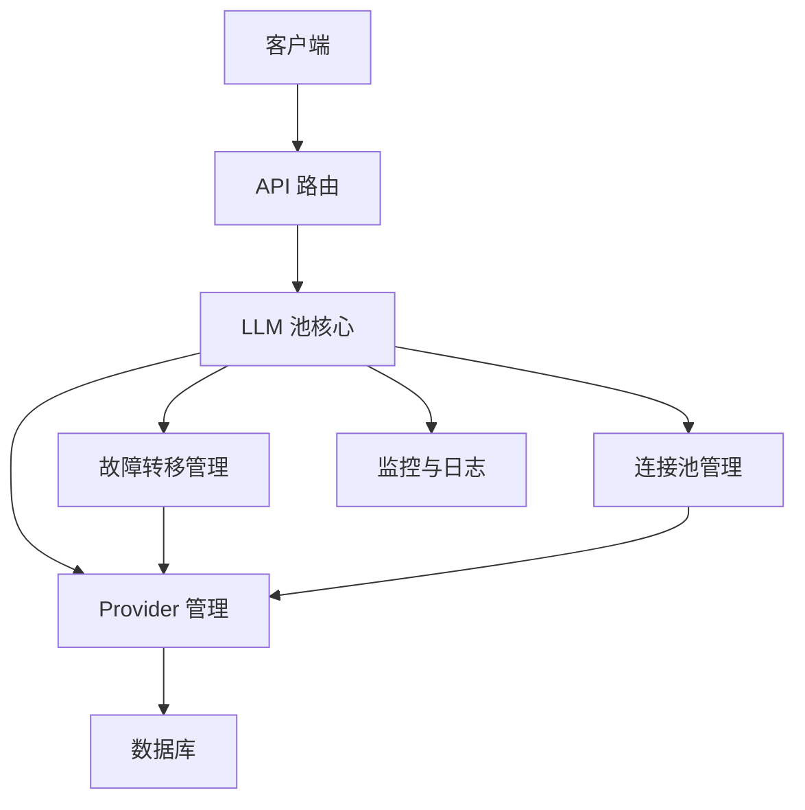

# LLM池开发文档

## 1. 项目概述

### 1.1 项目背景
当前LLM池存在多个功能缺陷，包括连接池管理、错误处理、配额管理、监控和日志等问题，需要进行全面改进以满足核心预期效果。

### 1.2 核心预期效果
- 支持配置多个大模型 API Key，对外提供统一调用接口
- 当某个 Key 额度用尽、触发限流或调用失败时，自动切换到下一个可用 Key，保证请求正常完成

### 1.3 技术栈
- 前端：Next.js 14+
- 后端：Node.js
- 数据库：SQLite/MySQL
- ORM：Prisma
- 大模型接口：OpenAI SDK

## 2. 系统架构

### 2.1 整体架构


### 2.2 模块划分

| 模块 | 职责 | 文件位置 |
|------|------|----------|
| API 路由 | 处理客户端请求 | src/app/api/ |
| LLM 池核心 | 核心业务逻辑 | src/lib/llmPool.ts |
| 连接池管理 | 管理 OpenAI 客户端连接 | src/lib/connectionPool.ts |
| 监控与日志 | 监控系统状态和记录日志 | src/lib/monitoring.ts |
| 安全管理 | 处理安全相关功能 | src/lib/security.ts |
| Prisma 客户端 | 数据库操作 | src/lib/prisma.ts |

## 3. 核心功能实现

### 3.1 多Key配置与统一接口

#### 3.1.1 数据模型
```prisma
model LlmApiProvider {
  id             String   @id @default(cuid())
  name           String   @unique
  apiKey         String
  baseUrl        String   @default("https://api.openai.com/v1")
  model          String   @default("gpt-4o-mini")
  priority       Int      @default(0)
  isActive       Boolean  @default(true)
  quotaRemaining Int?
  quotaUsed      Int      @default(0)
  lastUsedAt     DateTime?
  lastError      String?
  lastErrorAt    DateTime?
  createdAt      DateTime @default(now())
  updatedAt      DateTime @updatedAt

  @@index([isActive, priority])
}
```

#### 3.1.2 统一API接口
```typescript
// src/app/api/llm/route.ts
export async function POST(req: NextRequest) {
  try {
    const body = await req.json();
    const { model, messages, temperature, max_tokens } = body;
    
    const candidates = await getProviderCandidates();
    if (candidates.length === 0) {
      return NextResponse.json({ error: 'No available providers' }, { status: 503 });
    }

    const result = await withLlmFailover(
      candidates,
      async (client, model, sel) => {
        const completion = await client.chat.completions.create({
          model,
          messages,
          temperature,
          max_tokens,
        });
        return completion;
      },
      1 // 配额消耗
    );

    return NextResponse.json(result);
  } catch (error) {
    return NextResponse.json({ error: error.message }, { status: 500 });
  }
}
```

### 3.2 自动故障转移

#### 3.2.1 故障检测与处理
```typescript
// src/lib/llmPool.ts
export async function withLlmFailover<T>(
  candidates: ProviderSelection[],
  fn: (client: OpenAI, model: string, sel: ProviderSelection) => Promise<T>,
  quotaCost: number
): Promise<T> {
  if (candidates.length === 0) {
    throw new Error(API_QUOTA_EXHAUSTED_MESSAGE);
  }

  let lastErr: any = null;
  for (const sel of candidates) {
    if (sel.kind === 'db') {
      if (!(sel.provider.quotaRemaining === null || sel.provider.quotaRemaining > 0)) continue;
    }

    try {
      const { client, model } = await createOpenAiClient(sel);
      const result = await fn(client, model, sel);
      if (sel.kind === 'db') {
        await noteProviderUsed(sel.provider.id, quotaCost);
      }
      return result;
    } catch (err: any) {
      lastErr = err;
      if (sel.kind === 'db') {
        if (isQuotaError(err)) {
          await markProviderQuotaExhausted(sel.provider.id, String(err?.message || 'quota exhausted'));
        } else if (isRateLimitError(err)) {
          await markProviderError(sel.provider.id, String(err?.message || 'rate limit exceeded'));
        } else if (isConnectionError(err)) {
          await markProviderError(sel.provider.id, String(err?.message || 'connection error'));
        } else {
          await markProviderError(sel.provider.id, String(err?.message || 'error'));
        }
      }
      continue;
    }
  }

  if (lastErr && isQuotaError(lastErr)) {
    throw new Error(API_QUOTA_EXHAUSTED_MESSAGE);
  }

  throw lastErr || new Error('LLM request failed');
}
```

#### 3.2.2 错误分类
```typescript
// src/lib/llmPool.ts
export function isQuotaError(err: any): boolean {
  const status = err?.status ?? err?.response?.status;
  const message = String(err?.message || '');
  return (
    status === 402 ||
    status === 429 ||
    /insufficient[_ ]quota/i.test(message) ||
    /quota/i.test(message) ||
    /浣欓涓嶈冻|棰濆害|閰嶉|璧勬簮涓嶈冻/.test(message)
  );
}

export function isRateLimitError(err: any): boolean {
  const status = err?.status ?? err?.response?.status;
  const message = String(err?.message || '');
  return (
    status === 429 ||
    /rate[_ ]limit/i.test(message) ||
    /too[_ ]many[_ ]requests/i.test(message)
  );
}

export function isConnectionError(err: any): boolean {
  const message = String(err?.message || '');
  return (
    /connection/i.test(message) ||
    /timeout/i.test(message) ||
    /network/i.test(message)
  );
}
```

### 3.3 连接池管理

#### 3.3.1 连接池实现
```typescript
// src/lib/connectionPool.ts
class ConnectionPool {
  private pool: Map<string, OpenAI> = new Map();
  private maxConnections = 10;

  getClient(apiKey: string, baseUrl: string): OpenAI {
    const key = `${apiKey}:${baseUrl}`;
    if (this.pool.has(key)) {
      return this.pool.get(key)!;
    }

    if (this.pool.size >= this.maxConnections) {
      // 移除最久未使用的连接
      const oldestKey = this.pool.keys().next().value;
      this.pool.delete(oldestKey);
    }

    const client = new OpenAI({ apiKey, baseURL: baseUrl });
    this.pool.set(key, client);
    return client;
  }

  clear() {
    this.pool.clear();
  }
}

export const connectionPool = new ConnectionPool();
```

#### 3.3.2 集成到现有代码
```typescript
// src/lib/llmPool.ts
export async function createOpenAiClient(sel: ProviderSelection): Promise<{ client: OpenAI; model: string }> {
  const provider = sel.provider;
  const baseURL = normalizeBaseUrl((provider as any).baseUrl);
  const apiKey = (provider as any).apiKey;
  const model = (provider as any).model;
  // 使用连接池获取客户端
  const client = connectionPool.getClient(apiKey, baseURL);
  return { client, model };
}
```

### 3.4 配额管理

#### 3.4.1 配额计算与管理
```typescript
// src/lib/llmPool.ts
export async function noteProviderUsed(providerId: string, decrementQuotaBy: number): Promise<void> {
  await ensureProviderTable();
  const now = new Date().toISOString();

  // quotaRemaining NULL means unlimited.
  await prisma.$executeRaw(
    Prisma.sql`
      UPDATE LlmApiProvider
      SET
        quotaUsed = quotaUsed + ${decrementQuotaBy},
        quotaRemaining = CASE
          WHEN quotaRemaining IS NULL THEN NULL
          ELSE MAX(quotaRemaining - ${decrementQuotaBy}, 0)
        END,
        lastUsedAt = ${now},
        updatedAt = ${now}
      WHERE id = ${providerId}
    `
  );
}

export async function checkQuotaThresholds(): Promise<void> {
  const providers = await getActiveLlmProviders();
  for (const provider of providers) {
    if (provider.quotaRemaining !== null && provider.quotaRemaining < 100) {
      // 发送配额预警通知
      await sendQuotaWarning(provider.id, provider.name, provider.quotaRemaining);
    }
  }
}
```

### 3.5 监控与日志

#### 3.5.1 监控系统
```typescript
// src/lib/monitoring.ts
class MonitoringService {
  private metrics: Map<string, any> = new Map();

  recordRequest(providerId: string, duration: number, success: boolean, error?: string) {
    const key = `provider:${providerId}`;
    if (!this.metrics.has(key)) {
      this.metrics.set(key, {
        totalRequests: 0,
        successfulRequests: 0,
        failedRequests: 0,
        totalDuration: 0,
        lastRequestAt: new Date(),
        errors: new Map<string, number>(),
      });
    }

    const metric = this.metrics.get(key);
    metric.totalRequests++;
    if (success) {
      metric.successfulRequests++;
    } else {
      metric.failedRequests++;
      if (error) {
        const errorCount = metric.errors.get(error) || 0;
        metric.errors.set(error, errorCount + 1);
      }
    }
    metric.totalDuration += duration;
    metric.lastRequestAt = new Date();
  }

  getMetrics() {
    return Object.fromEntries(this.metrics);
  }

  getProviderStats(providerId: string) {
    const key = `provider:${providerId}`;
    return this.metrics.get(key);
  }
}

export const monitoringService = new MonitoringService();
```

#### 3.5.2 集成到现有代码
```typescript
// src/lib/llmPool.ts
export async function withLlmFailover<T>(
  candidates: ProviderSelection[],
  fn: (client: OpenAI, model: string, sel: ProviderSelection) => Promise<T>,
  quotaCost: number
): Promise<T> {
  if (candidates.length === 0) {
    throw new Error(API_QUOTA_EXHAUSTED_MESSAGE);
  }

  let lastErr: any = null;
  for (const sel of candidates) {
    if (sel.kind === 'db') {
      if (!(sel.provider.quotaRemaining === null || sel.provider.quotaRemaining > 0)) continue;
    }

    const startTime = Date.now();
    try {
      const { client, model } = await createOpenAiClient(sel);
      const result = await fn(client, model, sel);
      const duration = Date.now() - startTime;
      
      // 记录监控数据
      monitoringService.recordRequest(
        sel.kind === 'db' ? sel.provider.id : 'legacy',
        duration,
        true
      );
      
      if (sel.kind === 'db') {
        await noteProviderUsed(sel.provider.id, quotaCost);
      }
      return result;
    } catch (err: any) {
      const duration = Date.now() - startTime;
      lastErr = err;
      
      // 记录监控数据
      monitoringService.recordRequest(
        sel.kind === 'db' ? sel.provider.id : 'legacy',
        duration,
        false,
        err?.message
      );
      
      if (sel.kind === 'db') {
        if (isQuotaError(err)) {
          await markProviderQuotaExhausted(sel.provider.id, String(err?.message || 'quota exhausted'));
        } else if (isRateLimitError(err)) {
          await markProviderError(sel.provider.id, String(err?.message || 'rate limit exceeded'));
        } else if (isConnectionError(err)) {
          await markProviderError(sel.provider.id, String(err?.message || 'connection error'));
        } else {
          await markProviderError(sel.provider.id, String(err?.message || 'error'));
        }
      }
      continue;
    }
  }

  if (lastErr && isQuotaError(lastErr)) {
    throw new Error(API_QUOTA_EXHAUSTED_MESSAGE);
  }

  throw lastErr || new Error('LLM request failed');
}
```

## 4. 部署与配置

### 4.1 环境变量配置

| 环境变量 | 描述 | 默认值 |
|---------|------|--------|
| DATABASE_URL | 数据库连接字符串 | file:./dev.db |
| LLM_API_KEY | 默认 LLM API 密钥 | - |
| LLM_API_URL | 默认 LLM API 基础 URL | https://api.openai.com/v1 |
| LLM_MODEL | 默认 LLM 模型 | gpt-4o-mini |
| MAX_CONNECTIONS | 最大连接数 | 10 |
| QUOTA_WARNING_THRESHOLD | 配额预警阈值 | 100 |

### 4.2 Docker 部署

```dockerfile
FROM node:18-alpine

WORKDIR /app

COPY package*.json ./
RUN npm install

COPY . .

RUN npm run build

EXPOSE 3000

CMD ["npm", "start"]
```

### 4.3 启动命令

```bash
# 开发模式
npm run dev

# 生产模式
npm run build
npm start
```

## 5. 测试计划

### 5.1 单元测试

| 测试用例 | 测试内容 | 预期结果 |
|---------|---------|----------|
| getProviderCandidates | 获取可用的 Provider | 返回可用的 Provider 列表 |
| withLlmFailover | 故障转移功能 | 当一个 Provider 失败时，自动切换到下一个 |
| noteProviderUsed | 记录 Provider 使用情况 | 正确更新配额使用情况 |
| isQuotaError | 配额错误检测 | 正确识别配额错误 |
| connectionPool | 连接池管理 | 正确管理 OpenAI 客户端连接 |

### 5.2 集成测试

| 测试用例 | 测试内容 | 预期结果 |
|---------|---------|----------|
| API 调用 | 调用 LLM API | 成功返回结果 |
| 故障转移 | 模拟 Provider 失败 | 自动切换到下一个 Provider |
| 配额管理 | 模拟配额耗尽 | 正确处理配额耗尽情况 |
| 监控系统 | 监控 API 调用 | 正确记录监控数据 |

### 5.3 性能测试

| 测试用例 | 测试内容 | 预期结果 |
|---------|---------|----------|
| 并发测试 | 模拟 100 个并发请求 | 所有请求都能成功处理 |
| 响应时间 | 测试 API 响应时间 | 平均响应时间 < 1 秒 |
| 连接池 | 测试连接池性能 | 连接数不超过最大限制 |

## 6. 维护与监控

### 6.1 日志管理

- 应用日志：记录应用运行状态和错误信息
- 访问日志：记录 API 访问情况
- 错误日志：记录详细的错误信息

### 6.2 监控指标

- API 调用成功率
- 平均响应时间
- 每个 Provider 的使用情况
- 配额使用情况
- 错误率和错误类型分布

### 6.3 报警机制

- 配额预警：当配额接近耗尽时发送预警
- 错误率预警：当错误率超过阈值时发送预警
- 性能预警：当响应时间超过阈值时发送预警

### 6.4 常见问题处理

| 问题 | 可能原因 | 解决方案 |
|------|---------|----------|
| API 调用失败 | API 密钥无效 | 检查 API 密钥 |
| 配额耗尽 | 配额使用完毕 | 为 Provider 充值配额 |
| 连接超时 | 网络问题 | 检查网络连接，增加超时时间 |
| 模型不存在 | 模型名称错误 | 检查模型名称，使用正确的模型 |

## 7. 代码结构

```
src/
├── app/
│   ├── api/
│   │   ├── llm/                  # 新增：统一 LLM API 路由
│   │   │   └── route.ts
│   │   ├── llm-providers/        # Provider 管理 API
│   │   │   └── route.ts
│   │   ├── translate/             # 现有：翻译 API
│   │   │   └── route.ts
│   │   └── translate-only/        # 现有：仅翻译 API
│   │       └── route.ts
│   └── llm-config/                # LLM 配置页面
│       └── page.tsx
├── lib/
│   ├── llmPool.ts                 # LLM 池核心
│   ├── connectionPool.ts          # 新增：连接池管理
│   ├── monitoring.ts              # 新增：监控与日志
│   ├── security.ts                # 安全管理
│   └── prisma.ts                  # Prisma 客户端
├── components/
│   └── ui/                        # UI 组件
└── types/
    └── api.ts                     # TypeScript 类型定义
```

## 8. 安全措施

### 8.1 API 密钥安全
- API 密钥使用时进行脱敏处理
- 权限控制，只有管理员可以管理 API 密钥

### 8.2 输入验证
- 对所有输入进行验证，防止注入攻击
- 限制请求大小和频率，防止 DoS 攻击

### 8.3 错误处理
- 安全的错误处理，避免暴露敏感信息
- 详细的错误日志，但对客户端返回通用错误信息

### 8.4 依赖安全
- 锁定依赖库版本，避免安全漏洞
- 定期更新依赖库，修复安全漏洞

## 9. 总结

本开发文档详细描述了 LLM 池的改进方案，包括核心功能实现、系统架构、部署配置、测试计划和维护监控等内容。通过参考 one-api 的设计理念和实现方式，结合本文档的改进建议，可以实现一个功能完善、性能可靠的 LLM 池系统，满足核心预期效果：支持配置多个大模型 API Key 并提供统一调用接口，以及实现自动故障转移功能。

建议按照优先级逐步实现上述改进方案，以提高 LLM 池的可靠性、安全性和性能，为用户提供更好的使用体验。