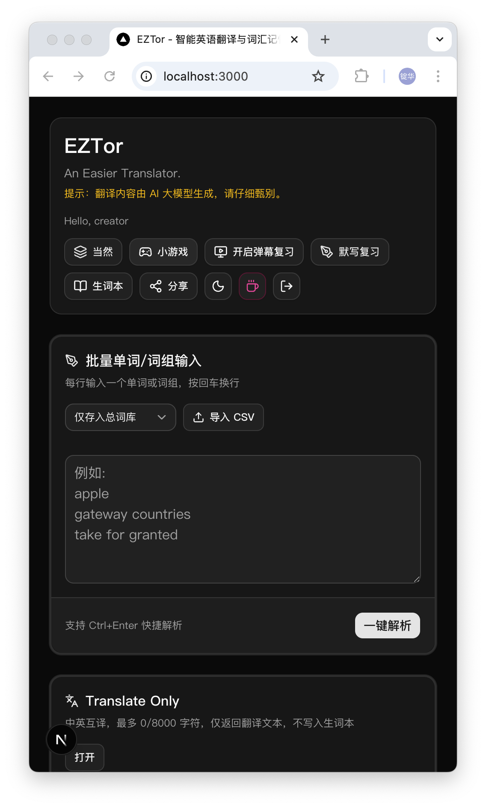

<p align="center">
  <a href="README.zh-CN.md">中文</a> · <strong>English</strong>
</p>

<p align="center">
  
  
  
  
  
  
  
</p>

# EZTor — Vocabulary Learning Platform

A full-stack Next.js application for English vocabulary learning, powered by LLMs.

<p align="center">
  
</p>

## How It Works

```
User Input → Security (CSRF, injection detection, rate limit, ban check)
          → Cache (LRU + DB) / Dedup
          → LLM Provider Pool (failover, quota management)
          → Translation Service (prompt engineering, quality scoring)
          → Stream response → Word sync to DB
```

The translation pipeline starts with multi-layer security checks, then queries a hot cache, selects an LLM provider with automatic failover, scores the result quality, and streams it back to the user—all within a single request lifecycle. High-quality results are automatically upserted to a public word library shared by all users.

Pain points solved:

- **Unusable single-word lookups** — LLM gives rich context: phonetic, POS, examples, countability, example translation
- **API vendor lock-in** — Configurable provider pool with automatic failover on quota depletion (402) or rate limits (429)
- **No auth friction** — 30 free daily translations without login; full word bank features after login
- **Public-facing security** — 5-layer defense: CSRF, injection detection, rate limiting, ban escalation, env validation

## Tech Stack

| Layer      | Technology                                    |
| ---------- | --------------------------------------------- |
| Framework  | Next.js 16 (App Router)                       |
| Language   | TypeScript                                    |
| Database   | PostgreSQL (Prisma ORM)                       |
| Auth       | NextAuth.js (JWT)                             |
| UI         | React 19, Tailwind CSS 4, shadcn/ui, Radix UI |
| Logging    | Pino                                          |
| Testing    | Vitest                                        |
| Deployment | Docker + docker-compose                       |

## Quick Start

```bash
cp .env.example .env
# Edit .env with your values

npm install
npx prisma generate
npx prisma migrate deploy
npm run dev        # → http://localhost:3000
```

## Key Features

- **Word Translation** — LLM-powered English-Chinese translation with POS, phonetics, examples, countability marking
- **Translate Only** — Quick translation without saving, 30 free uses/day; supports custom API keys
- **Word Bank** — Save words, create review groups, import CET-4/CET-6 vocabulary
- **Dictation / Review** — Smart review system with grouping, scoring
- **TTS** — Text-to-speech via Edge TTS
- **Danmaku Overlay** — Floating word display for passive learning
- **Infinite Tic-Tac-Toe** — Casual game widget
- **Admin Dashboard** — Analytics, public word library, translation records, user management, LLM provider pool
- **Security** — CSRF protection, prompt injection detection, rate limiting, ban escalation, device fingerprinting

## Project Structure

```
src/
├── app/            # Next.js App Router (pages + API routes)
│   ├── api/        # REST API endpoints
│   ├── analytics/  # Admin analytics dashboard
│   ├── dictation/  # Dictation / review
│   ├── history/    # Translation history
│   ├── game/       # Tic-Tac-Toe game
│   └── ...
├── components/     # React components (UI, vocabulary, share, review-group)
├── lib/            # Utilities (logger, rateLimiter, banManager, llmPool, cache, security)
├── services/       # Business logic (TranslationService, CacheService, StreamHandler)
└── __tests__/      # Unit tests
```

## Documentation

| Document                                         | Description                                       |
| ------------------------------------------------ | ------------------------------------------------- |
| [docs/ARCHITECTURE.md](docs/ARCHITECTURE.md)     | System architecture, design patterns, performance |
| [docs/ADMIN_GUIDE.md](docs/ADMIN_GUIDE.md)       | Admin operations manual                           |
| [docs/SECURITY.md](docs/SECURITY.md)             | Security guidelines and secret management         |
| [docs/BACKUP_RESTORE.md](docs/BACKUP_RESTORE.md) | Database backup and restore                       |
| [prisma/schema.prisma](prisma/schema.prisma)     | Data model definitions                            |
| [AGENTS.md](AGENTS.md)                           | AI coding agent instructions                      |

## License

GNU General Public License v3.0. See [LICENSE](LICENSE).
