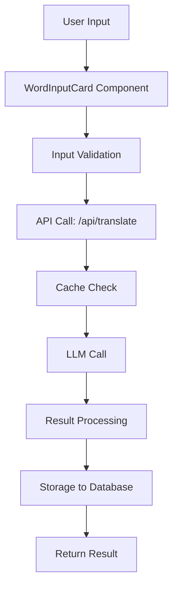
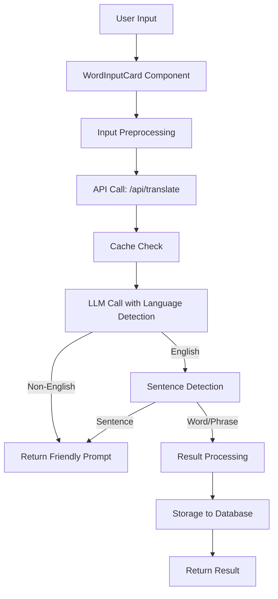
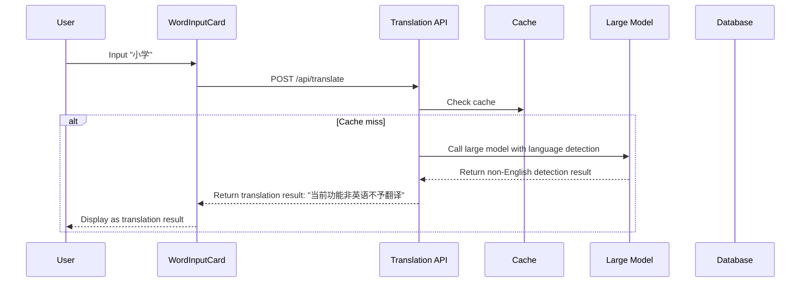
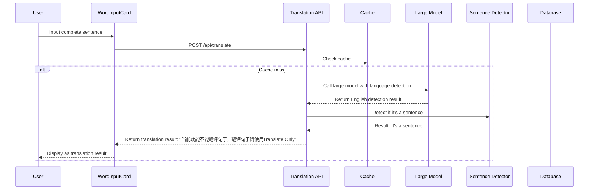
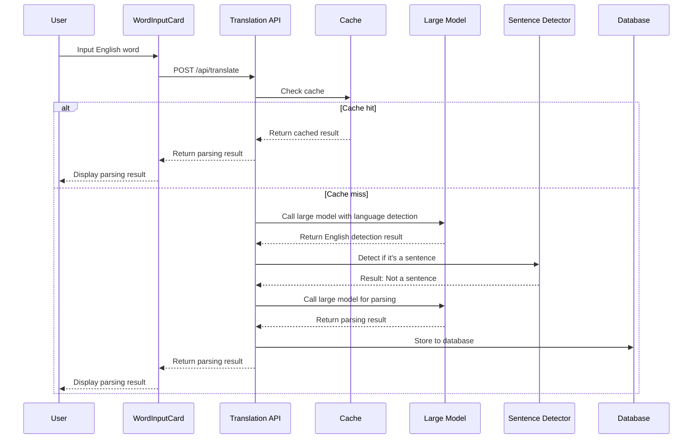

# Translation Project Technical Development Document

## 1. Problem Analysis Summary

### 1.1 Problem 1: Non-English Input Processing Issue
- **Phenomenon**: When users input Chinese vocabulary "小学" (elementary school), the system returns `n.[C]小学` as the parsing result, incorrectly adding English part-of-speech tags to Chinese vocabulary
- **Root Causes**:
  - Contradictory instructions in system prompt (English dictionary assistant vs. text translation processing)
  - Lack of language detection mechanism, non-English input is incorrectly passed to the large model
  - Insufficient input validation, no language verification before calling the large model
  - Improper error handling, no clear and friendly prompts for non-English input

### 1.2 Problem 2: Sentence Input Processing Issue
- **Phenomenon**: When users input a complete sentence "what should people do to make their visit new york city safe and pleasant", the system treats it as a word and stores it in the public word library
- **Root Causes**:
  - Missing input validation, no distinction between words, phrases, and complete sentences
  - Storage logic issue, complete sentences are stored in the public word library
  - Large model processing issue, no clear distinction between words, phrases, and sentences
  - User experience issue, unclear function differentiation and lack of guidance

## 2. Technical Architecture Description

### 2.1 Current Architecture


### 2.2 Improved Architecture


## 3. Interface Specification

### 3.1 Existing Interfaces
- **POST /api/translate**: Handles word parsing requests
  - Request body: `{ "words": string[], "options": { "showPos": boolean, "showExample": boolean }, "targetGroupId": string }`
  - Response: Stream returns parsing results

### 3.2 New Interfaces/Modifications
- **Modify POST /api/translate**:
  - Add language detection and sentence detection logic
  - Directly return error prompts for non-English input or sentence input
  - Request body remains unchanged
  - Response: Add error code and error message

- **New POST /api/translate/detect** (optional):
  - Purpose: Pre-detect input language and type
  - Request body: `{ "text": string }`
  - Response: `{ "language": string, "type": "word" | "phrase" | "sentence" }`

## 4. Data Flow Design

### 4.1 Non-English Input Processing Flow


### 4.2 Sentence Input Processing Flow


### 4.3 Normal Word Processing Flow


## 5. Error Handling Mechanism

### 5.1 Error Types
| Error Type | Error Code | Error Message | Handling Method |
|-----------|------------|---------------|-----------------|
| Non-English Input | 400 | 当前功能非英语不予翻译 | Return as translation result |
| Sentence Input | 400 | 当前功能不能翻译句子，翻译句子请使用Translate Only | Return as translation result |
| Empty Input | 400 | Input cannot be empty | Frontend validation |
| Input Too Long | 400 | Input length exceeds limit | Frontend validation |
| System Error | 500 | Internal system error | Log and return generic error |
| API Quota Exhausted | 503 | API quota exhausted | Return quota exhaustion prompt |

### 5.2 Error Handling Flow
1. **Frontend Error Handling**:
   - Input validation: Check empty input, length limit
   - Language detection: Pre-detect input language
   - Result display: Display translation results including non-English and sentence prompts

2. **Backend Error Handling**:
   - Input validation: Check input format, length
   - Language detection: Verify if it's English
   - Sentence detection: Verify if it's a sentence
   - Result return: Return fixed translation results for non-English or sentence input
   - Consistency: Ensure handling consistency with sensitive word mechanism

## 6. Performance Optimization Strategies

### 6.1 Language Detection Optimization
- **Lightweight language detection**: Use lightweight detection algorithm based on character set and common words
- **Cache detection results**: Cache language detection results for common inputs
- **Batch detection**: Batch detect multiple inputs to reduce repeated calculations

### 6.2 Input Validation Optimization
- **Frontend validation**: Perform preliminary validation on the frontend to reduce invalid requests
- **Pre-detection**: Perform real-time pre-detection during user input
- **Throttling**: Throttle input detection to avoid frequent detection

### 6.3 Storage Optimization
- **Public library filtering**: Strictly filter content stored in the public library
- **Quality scoring**: Optimize quality scoring algorithm to ensure only high-quality English words and phrases are stored
- **Batch storage**: Batch process storage operations for multiple words

### 6.4 Large Model Call Optimization
- **Input filtering**: Strictly filter input before calling the large model
- **Cache strategy**: Optimize cache strategy to reduce repeated calls
- **Batch processing**: Batch process multiple words to improve efficiency

## 7. Technical Implementation Details

### 7.1 Language Detection Implementation
- **Solution**: Use large model for language detection
- **Configuration**:
  - Update system prompt to ensure accurate language detection
  - Ensure non-English input is properly identified
  - Maintain consistent error handling with sensitive word mechanism
- **Integration method**:
  - Update system prompt to include language detection instructions
  - Ensure large model returns clear language detection results
  - Implement proper error handling for non-English input

### 7.2 Sentence Detection Implementation
- **Solution**: Heuristic detection based on length, punctuation, and word count
- **Rules**:
  - Length exceeds 50 characters
  - Contains multiple spaces (more than 3)
  - Contains punctuation (period, question mark, exclamation mark)
  - Word count exceeds 10
- **Implementation**:
  ```typescript
  // src/lib/sentenceDetector.ts
  export function isSentence(text: string): boolean {
    const trimmed = text.trim();
    const wordCount = trimmed.split(/\s+/).length;
    const hasPunctuation = /[.!?]/.test(trimmed);
    const hasMultipleSpaces = trimmed.split(/\s+/).length > 3;
    const isLong = trimmed.length > 50;
    
    return wordCount > 10 || (hasPunctuation && (hasMultipleSpaces || isLong));
  }
  ```

### 7.3 Input Validation Implementation
- **Modify WordInputCard component**:
  - Add real-time input detection
  - Display input type prompts
  - Provide function switching buttons
  - Display fixed translation results for non-English or sentence input

- **Modify translation API**:
  - Update system prompt for language detection
  - Process large model responses to identify non-English input
  - Return fixed translation results for non-English input or sentence input
  - Ensure result format consistency with sensitive word mechanism
  - Ensure no impact on Translate Only functionality

### 7.4 Storage Control Implementation
- **Modify public library storage logic**:
  - Add sentence detection in `calculateQualityScore` function
  - Reduce quality score for sentences
  - Limit content length stored in public library
  - Skip storage for non-English input

### 7.5 Prompt Structure Optimization
- **Update system prompt**:
  - Clearly define rules for handling non-English input and sentence input
  - Ensure the large model can correctly identify and process different types of input
  - Eliminate contradictory instructions in the prompt
  - Add specific language detection instructions
  - Define clear output format for non-English input

## 8. Test Validation Methods

### 8.1 Unit Tests
- **Language detection tests**:
  - Test English input detection via large model
  - Test non-English input detection via large model
  - Test edge cases (mixed languages)
  - Test prompt structure for language detection

- **Sentence detection tests**:
  - Test word input detection
  - Test phrase input detection
  - Test sentence input detection
  - Test edge cases (long phrases)

- **Input validation tests**:
  - Test empty input
  - Test overly long input
  - Test special character input
  - Test non-English input error handling

### 8.2 Integration Tests
- **API tests**:
  - Test non-English input processing via large model
  - Test sentence input processing
  - Test normal word input processing
  - Test result format consistency with sensitive word mechanism
  - Test JSON output format for non-English input
  - Test no impact on Translate Only functionality

- **UI tests**:
  - Test input detection prompts
  - Test fixed translation result display for non-English input
  - Test fixed translation result display for sentence input
  - Test function switching buttons
  - Test user guidance flow

### 8.3 Performance Tests
- **Response time tests**:
  - Test language detection response time
  - Test sentence detection response time
  - Test overall API response time

- **Load tests**:
  - Test concurrent request processing
  - Test batch input processing
  - Test cache performance

## 9. Implementation Steps

### 9.1 Phase 1: Infrastructure Setup
1. **Update system prompt**: Optimize and update large model prompt for language detection
2. **Modify API routes**: Add input validation logic for language detection
3. **Implement result handling**: Ensure consistency with sensitive word mechanism

### 9.2 Phase 2: Core Function Implementation
1. **Modify WordInputCard**: Add real-time input detection and display fixed translation results
2. **Modify translation API**: Implement large model-based language detection and return fixed translation results
3. **Optimize storage logic**: Limit public library storage and skip non-English input
4. **Update prompt structure**: Add specific language detection instructions and output format
5. **Ensure Translate Only compatibility**: Verify no impact on Translate Only functionality

### 9.3 Phase 3: User Experience Improvement
1. **Add function guidance**: Clearly distinguish functions on UI
2. **Optimize error prompts**: Provide friendly error messages
3. **Add function switching**: Provide switching options when sentences are detected

### 9.4 Phase 4: Testing and Optimization
1. **Unit tests**: Test functions of each module
2. **Integration tests**: Test overall flow
3. **Performance tests**: Test system performance
4. **Optimization adjustments**: Optimize based on test results

## 10. Technical Constraints

### 10.1 Dependency Constraints
- **Large model requirements**: Ensure large model can accurately detect language
- **Performance requirements**: Language detection via large model must be efficient
- **Accuracy requirements**: Language detection accuracy must reach above 95%

### 10.2 System Constraints
- **Compatibility**: Modifications must be compatible with existing API format
- **Backward compatibility**: Ensure existing functions are not affected
- **Extensibility**: Design should consider future language support expansion

### 10.3 Security Constraints
- **Input validation**: All inputs must be strictly validated
- **Error handling**: System information must not be leaked in error messages
- **Rate limiting**: Maintain existing rate limiting mechanism
- **Consistency**: Error handling must be consistent with sensitive word mechanism

## 11. Conclusion

This technical development document details the technical implementation details, solution design思路, specific implementation steps, and technical constraints for the identified issues in the translation project. By implementing large model-based language detection, sentence detection, optimizing storage strategies, updating prompt structure, and improving user interface, the problems of non-English input processing and sentence input processing can be effectively solved, and the professionalism and user experience of the system can be improved.

After implementing this solution, the system will be able to:
- Correctly identify and handle non-English input via large model, returning fixed translation results "当前功能非英语不予翻译"
- Correctly identify and handle sentence input, returning fixed translation results "当前功能不能翻译句子，翻译句子请使用Translate Only"
- Maintain high quality of public word library, only storing real English words and phrases and skipping non-English input
- Provide clearer, more professional user experience by displaying fixed translation results instead of error popups
- Ensure consistent result handling with sensitive word mechanism
- Maintain the original JSON output format for all responses
- Ensure no impact on Translate Only functionality

The technical team can proceed step by step according to the implementation steps in this document to ensure the smooth implementation of the solution, with a focus on optimizing the large model prompt, ensuring consistent result handling, and verifying no impact on Translate Only functionality.