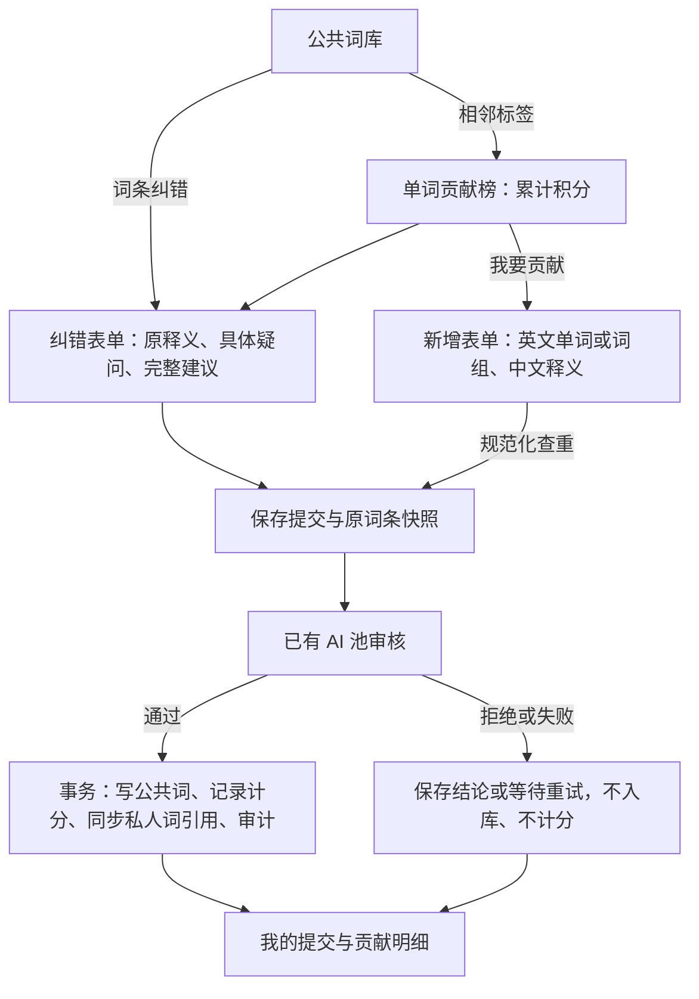

# 公共词库贡献：实现说明与验收记录

更新时间：2026-10-03，Asia/Shanghai。当前本地版本 1.18.0，未部署。

## 页面职责与流程

- 贡献榜仍是公共词库页内的同级标签；主导航和径向菜单没有新增独立入口，也没有顶部返回按钮。
- 提交必须登录；未登录从纠错链接登录后保留目标词条参数。
- 公共词库每个词条提供“释义有疑问？纠错”；贡献榜内也可自行输入目标词条。
- 新增和纠错均使用同一表单，具体审核结果留在“我的提交”（最近 20 条）。贡献明细展示有效/作废的最近记录（首页最多 50 条）。

## 数据与积分口径

- 英文输入执行 NFKC、首尾去空格、内部空白合并、转小写。单词/词组最多 80 字符、12 个词；释义 2–1500 字，纠错疑问 4–1000 字。服务器重复校验。
- 新增：库中没有该规范化词条，且 AI 确认真实词条及用户释义正确，才入库；首次计分为 1。删除再重建已有历史计分的词条不会重复得分。
- 纠错：原释义确有错误或实质遗漏、建议准确，才修改完整释义并计 1；纯格式调整、相同释义、不确定建议不计分。保留原有正确义项，不修改音标/例句等其他内容。
- 累计值 = 有效首次入库台账（精确归属的 USER_UPLOAD + 可信 T0 后的 USER_AI）+ 通过审核且未作废的纠错积分。新增提交的 receipt 不再次累加，避免双计。
- 不补算历史不明归属、不统计周/月。没有 T0 时，直接提交和纠错仍可准确累计；既有 AI 首录继续遵守可信起始时间规则。
- 默认仅本人可见；匿名/游戏昵称公开规则保持原有选择。管理员原作废/恢复接口同时支持纠错记录；作废计分不自动回滚词条释义，内容修改仍走已有管理员词库链路。

## 审核、并发与中断

- 复用 getProviderCandidates + withLlmFailover，最多 3 个现有候选，每次超时 40 秒。有效 AI 响应使用池侧计数；不调用用户额度检查、用量累加或学力奖惩。
- AI 只返回审核 JSON，用户输入被标记为不可信数据；输出字段经过类型和长度校验。模型审核并非绝对正确，保留结论、提供者 ID、模型和前后内容，以便管理员追溯。
- 客户端提交 UUID 是幂等标识；重复请求返还同一结论。相同 ID 换用户或换内容拒绝。同一规范化新增词条并发创建由公共词 unique 和首次台账 unique 防止本提交入口重复计分。
- 审核在数据库事务之外执行。通过后在事务内同时修改公共词、建立/维护私人词引用、记分和写 AuditLog；任何一步失败整体回滚。
- 纠错提交快照包括版本和原字段；写入时逐项比较，期间词条变化会返回 STALE，不覆盖较新的数据。
- 同一词条+同一规范化纠正结果的唯一 awardKey 防止再次获得相同纠错积分。
- PROCESSING 有 3 分钟租约；ERROR 或过期租约允许“重试审核”，重新认领 reviewToken。旧审核结果不能覆盖新认领任务。
- 网络断开时可刷新“我的提交”查看服务器记录。审核中可离开页面；开发服务/进程中断后的过期记录仍保留，可重试。表单尚未提交的输入不会跨页面自动持久化。
- CSRF、登录、账号/IP封禁和每分钟 3 次提交限制在服务端执行；限流不等于扣用户额度。

## 迁移与回滚

- 新迁移：`prisma/migrations/20261003040000_add_contribution_submissions/migration.sql`，只新增 ContributionSubmission 及索引/FK/check。
- 迁移前 localhost:5432/eztor 完整 pg_dump：
  `/Users/elee987/Library/Application Support/EZTor/backups/contributions-2026-10-03T04-00-10-787Z/eztor-local.dump`
- 大小 5,093,798 字节；SHA256 `9aa523a5851f7a638990bafdf2badb78e87f9c942cdc8e5604c27fe0ff9a065a`；pg_restore --list 成功，未做恢复演练。
- 迁移前后（提交验证前）均为 38 用户、17,731 公共词、17,731 原台账。迁移未修改现有数据。
- 回滚代码时保留新增表和提交记录；旧贡献页面不能显示新的纠错积分。不要通过删表/清库回滚。生产发布仍需生产完整备份、版本 bump 和独立的线上流程验收。

## 本地已验证与限制

- Prisma generate/migrate deploy、TypeScript、相关文件 ESLint 和 diff 空白检查通过。
- 实际浏览器提交 petrichor 及准确中文释义：APPROVED，新增公共词和首次台账各 1，贡献 0→1。
- 同一 UUID 重复点击不产生新记录/新积分；全角大写重复提交返回 DUPLICATE、0 分。
- 实际提交 run 原释义中的过去式错误：AI 通过审核，纠正为过去式 ran、过去分词 run；version 1→2，贡献 1→2，审计包含前后内容。
- 无意义词 zxqvplornword 返回 REJECTED、0 分，公共词库不存在该词。
- 验证后本地：38 用户、17,732 公共词、17,732 首次台账、4 提交、2 条本功能审计。保留正确的新词/纠正与提交记录以便本地查看。
- 验证前后当前管理员 TranslateOnlyUsage、AiAskLog 数量、combatPower、dailyPowerGained 相同。
- 匿名 GET/POST 提交接口均 401；手机 390×844 检查表单和记录、无横向溢出。
- 未运行测试套件；未模拟池全失败、服务强停恢复、并发竞争、管理员作废恢复或非管理员权限边界；未做 iOS/Android 真机、生产部署/线上验收。本地正常路径通过不代表这些路径已验收。
