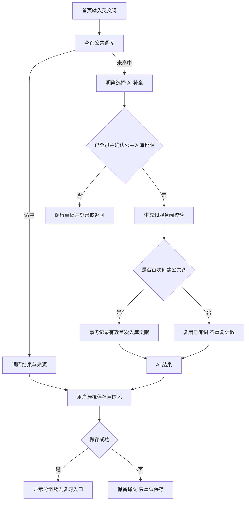

# EZTor 六项剩余待办：产品与界面设计方案

审阅日期：2026-10-02（Asia/Shanghai）<br>
交接对象：产品负责人、设计评审者、后续分阶段实现的 GPT-6 Luna<br>
状态：原设计与既有实现的历史记录；不能据此把六项全部视为已验收。实际检查结果和边界见 [平台验证记录](./platform-validation-report.md) 与 [工作记录](../工作记录.txt)。

> **2026-10-02 最新产品澄清：翻译部分以 [翻译体验重新设计](./translation-experience-redesign.md) 为准。** 两条入口分别是实时翻译和补充查询；贡献来自实时入口的首次有效公共词入库。第二入口默认中文找英文，补充句子翻译和结果旁的用法解释。翻译与问答不扣学力，页面不显示免费或额度计数，用户可直接操作。下文与此冲突的 T5、三种技术模式并列、文本翻译优先和 D4 旧结论已被替代；原有中文检索和问答能力并未被用户要求删除。

## 0. 使用说明与范围

本方案以当前工作区代码为主，以工作记录补充完成情况。已先阅读根目录 [AGENTS.md](/Users/elee987/Downloads/web_compressed/AGENTS.md) 和 [工作记录.txt](/Users/elee987/Downloads/web_compressed/工作记录.txt)，再针对六项待办检查页面、组件、接口、模型与客户端桥接。没有连接生产数据库核对词条归属，没有进行本轮真机操作测试。下文把代码事实、风险推断和待核实项分开陈述。

本次只新增本文档，不修改应用代码、版本、工作记录或管理员待办，不执行迁移和部署。当前工作区原本已有未提交改动，不应在后续实现中被覆盖。

范围只包含：贡献榜、移动输入适配、App 设计与平台评估、主要任务流程、翻译优化、音效/触感/主题/动效。新版新手引导、公共词库展示下载、GitHub/SEO 均按用户要求视为完成。错词本、分享、公共词库只作为已有依赖，不另立重做项目。

本文采用三项明确的设计假设，均为推荐方案，产品待决策项见第 9 节：

1. “新单词贡献”先指**第一次进入公共词库的有效词条**，不把每个人收藏同一个词都算作贡献。
2. 继续使用现有 Web、Electron 和 Android WebView 基础；完整原生重写只进入验证选项。
3. 先让用户完成查词、保存与复习，再增加视觉反馈。辉金是一个主题系列，包含白金与黑金两种完整外观；不会替换掉原有主题。

产品决策更新（2026-10-02）：用户已确认 D1、D2、D4、D5 的推荐方案。D3 改为由用户在“我的”页选择是否自动保存，默认开启；声音/提示音默认开启。后续实现以这些明确决定为准，不再把 D1–D5 标作待批准。

后续实现者按第 7 节逐包执行，完成一个包并验收后再继续。进入代码实现前，必须重新读取适用的 AGENTS.md，并先阅读 [本地 Next.js 指南目录](/Users/elee987/Downloads/web_compressed/node_modules/next/dist/docs) 中与本包有关的指南；不得直接按常见 Next.js 版本习惯实现。本文不提供应用代码。

## 1. 现状摘要与证据索引

### 1.1 证据索引

以下编号供全文引用。路径均来自此次针对性审阅；行号是审阅时的定位辅助，后续修改后应按符号名称查找。

| 编号 | 已检查的证据 | 可以支持的结论 |
| --- | --- | --- |
| E01 | [工作记录.txt](/Users/elee987/Downloads/web_compressed/工作记录.txt)、[package.json](/Users/elee987/Downloads/web_compressed/package.json)、[已安装 Next.js 元数据](/Users/elee987/Downloads/web_compressed/node_modules/next/package.json) | 当前包版本为 1.17.1，声明 Next.js `^16.2.3`，本地安装版为 16.2.3，使用 React 19、Prisma 5；记录最后一次 Web 发布为 1.17.1。安装包曾仍为 1.13.4，不能把 Web 版本当成用户安装包版本。 |
| E02 | [schema.prisma：PublicWord](/Users/elee987/Downloads/web_compressed/prisma/schema.prisma:162)、[Word](/Users/elee987/Downloads/web_compressed/prisma/schema.prisma:361)、[User](/Users/elee987/Downloads/web_compressed/prisma/schema.prisma:313) | PublicWord 有唯一 word、内容、质量分、版本和时间，没有 createdBy/贡献者。Word.userId 是私有收藏归属；sourceType/publicWordId 不能证明谁首次创建公共词。 |
| E03 | [PublicWordService](/Users/elee987/Downloads/web_compressed/src/services/PublicWordService.ts:17)、[TranslationService](/Users/elee987/Downloads/web_compressed/src/services/TranslationService.ts:299)、[公共词管理员 API](/Users/elee987/Downloads/web_compressed/src/app/api/public-words/route.ts:237) | AI 词条可自动写入公共库；服务构造器虽接收 userId，创建 PublicWord 时没有持久化该人。管理员另有直接新增入口。质量更高的结果可以更新公共内容。 |
| E04 | [分享导入 API](/Users/elee987/Downloads/web_compressed/src/app/api/share/import/route.ts:449)、[relink-orphan-words](/Users/elee987/Downloads/web_compressed/scripts/relink-orphan-words.ts:76)、[fix-source-words](/Users/elee987/Downloads/web_compressed/scripts/fix-source-words.ts:67)、[fix-share-source-words](/Users/elee987/Downloads/web_compressed/scripts/fix-share-source-words.ts:63)、[旧库迁移脚本](/Users/elee987/Downloads/web_compressed/scripts/migrate-sqlite-to-pg.ts:45) | 分享导入缺少公共词时也会创建；修复/迁移脚本也能写公共词。必须覆盖这些来源的归类，不能只统计 AI 调用。脚本这里只检查了相关写入位置，未执行。 |
| E05 | [翻译 API](/Users/elee987/Downloads/web_compressed/src/app/api/translate/route.ts)、[公共查询 API](/Users/elee987/Downloads/web_compressed/src/app/api/public-translate/route.ts)、[qualityScoring](/Users/elee987/Downloads/web_compressed/src/lib/qualityScoring.ts) | TranslationRecord 记录查询，可含缓存结果；不是公共词首次创建账本。qualityScore 主要来自字段完整度与长度，不等于语言准确率。 |
| E06 | [首页 HomeContent](/Users/elee987/Downloads/web_compressed/src/components/home/HomeContent.tsx:68)、[AppLayout](/Users/elee987/Downloads/web_compressed/src/components/layout/AppLayout.tsx)、[侧栏](/Users/elee987/Downloads/web_compressed/src/components/layout/AppSidebar.tsx)、[底栏](/Users/elee987/Downloads/web_compressed/src/components/layout/MobileNavBar.tsx) | xl 以下用底部四导航；首页手机端以闪卡为主，登录用户的实时查词默认折叠，游客没有这个手机查词面板；桌面左查词、右中译英。 |
| E07 | [WordInputRow](/Users/elee987/Downloads/web_compressed/src/components/home/WordInputRow.tsx)、[WordTranslationPanel](/Users/elee987/Downloads/web_compressed/src/components/home/WordTranslationPanel.tsx:120)、[useRealtimeTranslation](/Users/elee987/Downloads/web_compressed/src/hooks/useRealtimeTranslation.ts:91) | 主输入已有 IME Enter 防护和小屏 16px；公共查询 300ms 防抖，命中后 3 秒自动保存；AI 单词并发数为 5，支持单行/全部取消入口。CSV 解析后只提示成功，未调用添加词条或设置输入列表。 |
| E08 | [默写页](/Users/elee987/Downloads/web_compressed/src/app/dictation/page.tsx:671)、[ReviewNavigation](/Users/elee987/Downloads/web_compressed/src/components/dictation/ReviewNavigation.tsx)、[生词本](/Users/elee987/Downloads/web_compressed/src/app/history/page.tsx:783)、[错词本](/Users/elee987/Downloads/web_compressed/src/app/mistakes/page.tsx) | 已有常规默写/错词本并列入口、配置滚动区、进度恢复和错词专练；默写局部及全局 Enter 处理未见 IME 防护。生词本窄屏词条为三列，标题有 max-content/nowrap 约束。 |
| E09 | [ZhEnAssistant](/Users/elee987/Downloads/web_compressed/src/components/ai/ZhEnAssistant.tsx)、[中译英 API](/Users/elee987/Downloads/web_compressed/src/app/api/zh-to-en/route.ts)、[zhEnLookup](/Users/elee987/Downloads/web_compressed/src/lib/zhEnLookup.ts)、[/ai](/Users/elee987/Downloads/web_compressed/src/app/ai/page.tsx) | 当前“更多翻译”先进入中文释义反查；只保留汉字后做 contains 查询，默认至多 20 个候选，以质量分排序。API 把超过 20 行的输入直接截断；返回 total 是本次返回数，不是完整匹配总数。 |
| E10 | [AiAssistant](/Users/elee987/Downloads/web_compressed/src/components/ai/AiAssistant.tsx:155)、[AI ask API](/Users/elee987/Downloads/web_compressed/src/app/api/ai/ask/route.ts)、[AiAssistantService](/Users/elee987/Downloads/web_compressed/src/services/AiAssistantService.ts) | 已有流式 AI 询问、查词及加入分组提议、确认操作和按用户保存的本地对话；发送已有 IME 防护。普通用户一次扣 10 学力，免费标记用户免扣；后端有失败退款分支。 |
| E11 | [translate-only API](/Users/elee987/Downloads/web_compressed/src/app/api/translate-only/route.ts)、[翻译提示词](/Users/elee987/Downloads/web_compressed/src/lib/translatePrompts.ts)、[额度逻辑](/Users/elee987/Downloads/web_compressed/src/lib/translateOnlyUsage.ts)、[LimitExceededModal](/Users/elee987/Downloads/web_compressed/src/components/home/LimitExceededModal.tsx) | 句子/文本翻译及可选润色 API 已存在，中英自动互译；系统额度 30 次/日，UTC+8，管理员豁免；自定义密钥分支存在。当前 src/app 与 src/components 的调用检索未见主界面对 translate-only 的调用，限额弹窗也不能据存在就视为有可达入口。 |
| E12 | [brand-theme-provider](/Users/elee987/Downloads/web_compressed/src/components/brand-theme-provider.tsx:5)、[mode-toggle](/Users/elee987/Downloads/web_compressed/src/components/mode-toggle.tsx)、[globals.css](/Users/elee987/Downloads/web_compressed/src/app/globals.css:136)、[layout](/Users/elee987/Downloads/web_compressed/src/app/layout.tsx) | 已分离 light/dark/system 与 neutral/purple；品牌保存在 localStorage 的 brand-theme，通过根元素 data 属性应用。默认紫色、默认浅色，首屏脚本只处理 neutral。 |
| E13 | [preferences API](/Users/elee987/Downloads/web_compressed/src/app/api/preferences/route.ts)、[我的页](/Users/elee987/Downloads/web_compressed/src/app/me/page.tsx)、[UserPreference](/Users/elee987/Downloads/web_compressed/prisma/schema.prisma:342) | 数据库虽有 theme、显示选项字段，当前 preferences API 只读写学习目标与复习提醒；不能假定已有跨设备主题同步或全局反馈设置。 |
| E14 | [ttsBrowser](/Users/elee987/Downloads/web_compressed/src/lib/ttsBrowser.ts)、[TTS API](/Users/elee987/Downloads/web_compressed/src/app/api/tts/route.ts)、[默写声音初始化](/Users/elee987/Downloads/web_compressed/src/app/dictation/page.tsx:267) | 已有 TTS 请求、IndexedDB 缓存、浏览器朗读回退；默写有正确/错误两段音效及独立静音变量。查验的核心代码未见统一触感与减少动态效果治理。 |
| E15 | [manifest](/Users/elee987/Downloads/web_compressed/src/app/manifest.ts)、[desktop/package.json](/Users/elee987/Downloads/web_compressed/desktop/package.json)、[desktop/main.js](/Users/elee987/Downloads/web_compressed/desktop/main.js)、[preload](/Users/elee987/Downloads/web_compressed/desktop/preload.js)、[MainActivity](/Users/elee987/Downloads/web_compressed/android/app/src/main/java/com/eztor/app/MainActivity.java:41)、[AndroidManifest](/Users/elee987/Downloads/web_compressed/android/app/src/main/AndroidManifest.xml) | 已有 Electron 和直接加载线上网站的 Android WebView，含弹幕/分享等桥接。存在 Web manifest；在相关入口、客户端库和 public 的定向检索中未发现 service worker 注册与离线导航实现，离线能力不能据此宣称完整。 |
| E16 | [现有榜单页面](/Users/elee987/Downloads/web_compressed/src/app/leaderboard/page.tsx)、[现有榜单 API](/Users/elee987/Downloads/web_compressed/src/app/api/game/leaderboard/route.ts)、[GameService.getLeaderboard](/Users/elee987/Downloads/web_compressed/src/features/gamification/services/GameService.ts:491)、[UserGameProfile](/Users/elee987/Downloads/web_compressed/prisma/schema.prisma:504)、[middleware](/Users/elee987/Downloads/web_compressed/src/middleware.ts) | 已有登录可见的学力榜，按总/月/周/学区排名，使用游戏昵称，可能展示旧昵称；页面无昵称时会弹设置框。它不是贡献榜；现有榜单返回用户 ID 与昵称历史，不宜原样作为新榜隐私契约。 |

### 1.2 六项的现状结论

| 待办 | 已有能力 | 本轮要解决的缺口 | 证据与可信程度 |
| --- | --- | --- | --- |
| T1 单词贡献榜 | 公共词库、私有词条、查询记录、学力榜 | 公共词首次录入归因、明确计数、隐私展示、新榜入口 | E02–E05、E16；模型缺口已确认，历史可追溯覆盖率待核实 |
| T2 手机页面/输入 | 底栏安全区、部分 dvh 布局、主输入 IME/字号、复习配置滚动 | 键盘遮挡、跨页面输入行为、触控区、长词/长组名、滚动所有权 | E06–E08；代码风险明确，设备表现待真机验证 |
| T3 App 设计/原生探索 | 响应式 Web、Electron、Android WebView、manifest | 一致界面语言、平台能力验证与投入决策 | E12、E15；已有壳已确认，不代表已有完整原生学习界面 |
| T4 主要任务引导/UI | 首页查词和闪卡、词库、复习/错词本、AI、我的 | 入口分散、查词在手机折叠、保存后下一步不清楚 | E06–E10；保留已完成的 8 步新手引导 |
| T5 翻译 | 词库查询、AI 补全、中译英候选、AI 询问、独立文本 API | 模式命名、入库一致性、候选质量说明、错误恢复、文本入口衔接 | E05、E07、E09–E11；区分活跃入口与留存 API |
| T6 音效/触感/主题/动效 | 两种品牌 × 明暗、TTS、默写正误音效、局部动画 | 白金/黑金完整视觉、反馈偏好、能力回退、无障碍控制 | E12–E15；触感桥接与统一偏好属于新增 |

工作记录中的 390×844 浏览器检查、线上 16px 检查，只能证明当时那些页面和动作；不能替代 iOS 键盘、Android 输入法、平板和安装态复测。记录早期“未完成”的条目以较晚发布记录及用户本次明确排除项为准。

## 2. 目标、优先级与依赖

### 2.1 产品目标

| 项目 | 解决的问题 | 目标结果 | 优先级 |
| --- | --- | --- | --- |
| T2 移动适配 | 能看到却难输入、难点击，键盘破坏布局 | 在小屏完整完成查词、保存、答题，不丢输入、不误提交 | P0 |
| T5 翻译可靠性 | 用户不清楚查到了什么、保存到了哪里、失败怎么办 | 每条结果都有来源、处理状态、保存结果及准确的重试入口 | P0，文本入口增强为 P1 |
| T4 主要任务流程 | 首屏功能争抢注意力，用户找不到下一步 | 查词直接开始，查到后可保存/复习，登录后回到原任务 | P1 |
| T6 与 T3 的设计系统 | 外观和反馈不一致，主题停留在换色 | 两套辉金完整覆盖核心页面，所有反馈可控且不影响阅读 | P1 |
| T1 贡献榜 | 用户贡献不可见，历史归因不可靠 | 从可信起点计数，能解释每一条贡献与每一个排名 | P1；账本先于榜单 |
| T3 平台验证 | “像 App”与“要原生”混在一起 | 有设备证据和成本边界后再决定 PWA/壳增强/原生试验 | P2，不阻塞 Web 修复 |

### 2.2 建议阶段

1. **S0：确定口径与复现基线。** 确认第 9 节中会改变数据语义的决策；按第 8 节设备矩阵复现。视觉原型可先评审，不等待数据库工作。
2. **S1：T2 + T5 的可靠性。** 输入/布局与查词、保存、取消、CSV、限流问题先收口。不能用新皮肤掩盖失败。
3. **S2：T4 主流程 + T3/T6 视觉底座。** 调整入口层级，落地语义颜色和白金/黑金，对现有功能只改必要的呈现与衔接。
4. **S3：T1 账本、隐私与榜单；T5 文本翻译入口；T6 反馈完善。** 分开提交与验收，贡献账本依赖 S1 的入库边界；新榜不依赖文本翻译或原生。
5. **S4：T3 平台验证。** 同一组学习任务比较浏览器、安装态和现有壳，只有满足门槛才立项原生验证。

成功标准以任务完成率与数据正确性为主。建议用 5 名目标用户做形成性测试，分别覆盖新用户、常用查词者、以复习为主者；每人执行查词、保存到指定分组、开始复习三个任务。目标为每任务至少 4/5 人无口头提示完成；这是待测目标，不是已有成绩，也不把小样本结果当成统计证明。

## 3. 产品设计与功能规则

### 3.1 T1：首次入库贡献榜

#### 用户价值与计数对象

给予扩充共享词汇资源的人可理解的认可，同时向用户解释自己的行为是否有公共价值。页面名称为“单词贡献榜”，指标名称为“首次入库词条”；AI 帮助生成的内容注明“由用户发起入库”，不声称用户手写了释义。

推荐计数单位：**规范化后的一个公共英文单词或词组，首次有效创建成功计 1 条**。本期不新增积分、学力奖励、连续签到或编辑贡献权重，以免与现有学力系统混淆或鼓励刷量。

| 情形 | 首次入库贡献计数 | 理由 |
| --- | --- | --- |
| 登录用户显式发起 AI 补全，创建此前不存在的有效公共词条 | 创建提交成功后 +1 | 发起人与实际首次写入能在同一服务端操作中关联 |
| 查到已有公共词、收藏到个人词库、同词加入不同分组 | 0 | 收藏不是公共新词 |
| 重新查询、网络重试、大小写/首尾空格差异 | 0 个额外计数 | 规范化键和唯一约束防重复 |
| 两人同时录入同一个新词 | 仅实际成功完成首次创建的事务归属者 +1 | 不按前端开始时间抢先；另一人显示“词条已存在” |
| 更新释义、例句或质量分 | 0 | 本期只统计首次新增；可解释“更新不计入本榜” |
| 管理员人工维护、迁移、种子、修复脚本 | 记录来源为管理/系统，不进入个人排行 | 运维操作不与学习用户竞争 |
| 分享导入产生缺失的公共词 | 记录 SHARE_IMPORT 来源，本期不归给导入者或分享者 | 导入者不等于作者，分享者也未必是原始录入者 |
| CSV 导入已有释义到个人库 | 0 | 不因私人文件入库自动贡献；若随后用户显式 AI 补全且符合首创条件，才按该次公共创建计数 |
| 错误词、空释义、拒绝/中断占位、句子误入单词通道 | 0 | 不能奖励无效数据 |
| 历史词条无法确认来源 | 标为历史/未知，不计个人榜 | 不猜测归属 |

“有效”最低标准是服务端通过词条格式/字段校验、有非空释义、不是错误占位或被限制的无效输出，并成功提交公共词。现有质量分只能辅助排查，不以“分数越高越贡献”或“字符串越长越优质”加分。不向用户展示虚构的“准确率 98%”。涉嫌滥用的记录可由管理员作废并注明内部原因；不扩大成完整投稿审核系统。

保留当前小写与首尾去空格的兼容口径；内部空格、弯引号、连字符、词形合并在新唯一键上线前做碰撞检查。首版不把复数、时态或近义词自动合并。不要在加榜单时顺便重新规范化整个词库。

#### 时间与排名

- 提供“本周 / 本月 / 累计”，默认本月；周从北京时间周一 00:00 开始，月从每月 1 日 00:00 开始，右侧显示完整日期范围与“北京时间”。数据库存 UTC，按明确的 UTC+8 边界查询。
- 累计从可信记录启用时间 T0 起计，标题下常驻“从 YYYY-MM-DD 起统计；历史未追溯词条不参与”。不能标作创站以来完整累计。
- 按区间内仍有效的贡献数降序；同分显示并列排名，例如 1、2、2、4。并列行内部按稳定公开随机标识排序，不用账号注册时间打破荣誉并列，也不把内部 userId 发给客户端。
- 页面 20 人一页，显示有效参与人数、个人区间计数、更新时间。个人不在当前页仍显示自己的名次；零贡献显示“本期尚无贡献”，不显示第 0 名。
- 个人隐藏榜单时，显示“未参与公开排名”，仍可看自己的数量。公共汇总可包含未公开身份的有效贡献；“公开参与人数”只算选择参与的人，文案区分两者。
- 作废后按原发生时间从相应区间扣除。删除并重建同一规范化词条不重新授予；撤销误作废后恢复原归属与原时间。榜单不靠每月清零数据库来计算。
- 榜单推荐最多缓存 60 秒，显示更新时间；隐私变更、账号删除、作废要失效对应缓存，不能让关闭公开后继续显示一小时。

#### 入口、身份与权限

复用现有 `/leaderboard` 的一级入口，页内增加“学力榜 / 单词贡献榜”分类；贡献榜建议使用独立子路由 `/leaderboard/contributions`。桌面保留排行榜侧栏入口；手机“我的 → 排行榜 → 单词贡献榜”。公共词库只增加一个低优先级“查看贡献规则/贡献榜”链接，不调整它的搜索、列表、下载流程。

建议首版与现有学力榜一样只对登录用户开放，不因新增页面顺便公开全站用户资料。未登录点击保留目标路径，登录后返回贡献榜。公共词库链接可见，登录要求在点击前可预期。

新贡献子页只复用导航外壳，不直接套用现有榜单页面的全部副作用：进入贡献榜不能自动弹改昵称、同步外部昵称或打开分享。现有学力页及其新手引导行为保持原样；匿名贡献无需设置昵称。

新榜默认“仅自己可见”，用户明确选择参与后可选：

1. **匿名参与**：展示系统生成的稳定随机代号，如“贡献者 K7Q4”，不从 userId、账号或邮箱截取。代号用于区分榜单条目，不承诺无法被其他线索关联。
2. **昵称参与**：预览后使用现有 GameProfile.nickname；没有昵称时回退匿名。展示当前昵称，不展示旧昵称，不回退 username、邮件或外部身份资料。昵称更改沿用原有规则，本项目不另建改名系统。
3. **退出公开展示**：移出公开行及公开排名，保留本人统计；即时更新展示与缓存。

其他用户只能看到公开名称、计数、名次及是否自己；不能查看某人的逐词录入时间、查询记录、私有词库、IP、UA、账号名或管理员标志。本人可查看自己的贡献明细（词、时间、有效/作废状态、简明原因），不开放按任意 userId 查询的通用接口。管理员可以核对来源、原始归因和作废原因；只在现有公共词管理范围内增加相关能力，不操作 AdminTodo。

账号删除：删除公开参与资料，账本解除可识别的用户关联并保留匿名数量依据；已公开的词条是否继续留库沿用词库政策，不能因个人榜退出删除公共词。账号封禁先暂停公开展示；是否作废由贡献真实性决定，不把所有封禁直接等价为假贡献。

#### 数据缺口与迁移选择

PublicWord.createdAt 只证明词条建立时间；最早 Word.createdAt 可能来自导入、同步或删后重建；TranslationRecord.isCached=false 也不是创建成功凭证。AuditLog 有通用结构，但检查到的公共新建路径没有统一写入“首次词条 + 创建者”事件。已有 userId 参数未落库，不能恢复为可靠历史事实。

| 方案 | 能得到什么 | 风险/成本 | 建议 |
| --- | --- | --- | --- |
| A：从 T0 起建立可信账本 | 新发生事件精确，历史显示未知 | 早期贡献不能个人归因 | **首版推荐** |
| B：只回填有独立创建凭证的历史记录 | 局部历史可以恢复 | 需要逐来源审计、明确证据等级及去重 | 后续可选；无证据保持未知 |
| C：用最早收藏/查询近似回填 | 看似完整的历史榜 | 容易把导入者、重复查询者误认成首创者 | 不推荐；如研究使用，只能内部估算，不能正式排行 |

迁移前待核实：数据库实际历史覆盖、大小写变体、脚本运行来源、删除/重建频率、是否存在外部写入任务。不能通过读代码直接给出“可回填多少人/多少词”的结论。

### 3.2 T2：移动页面与输入适配

#### 已完成部分必须保留

WordInputRow 已检查 isComposing/keyCode 229，主输入小/中屏 16px；AiAssistant 的发送也已有 IME 防护；底栏包含安全区；复习配置已能在短屏滚动。后续是扩大覆盖和验证，不重写这些已成立的行为。

#### 风险清单与修复顺序

| 等级 | 现状与具体风险 | 目标规则 | 主要范围 |
| --- | --- | --- | --- |
| P0 | 首页 h-screen、内部 flex 和固定底栏并用；/ai 自算高度；不同页面扣底栏方式不一 | 每种页面指定唯一主滚动容器，统一可用视口与安全区，输入和操作始终能滚进可见区 | AppLayout、HomeContent、/ai、默写 |
| P0 | 默写输入和全局 Enter 未见组合输入检查 | IME 确认候选只交给输入法，不提交、不下一题；弹窗输入期间全局快捷键不接管 | 默写输入、全局监听 |
| P0 | 公共查词 onChange 在 IME 期间仍可能发请求；响应只按 entryId 更新 | 组合输入结束后再查询；只有“当前行 + 当前文本版本”的响应能更新 UI/启动保存 | WordInputRow、useRealtimeTranslation |
| P0 | 行删除/发音、CSV 按钮、分组选择器等有 24–36px 控件 | 主要触控目标至少 44×44 CSS px，可用透明外扩命中区；相邻命中区不重叠 | 核心输入、翻译、词卡、设置 |
| P1 | 通用 Input/Textarea 在 md 起缩到 14px，局部另覆字号 | 手机与触屏平板的可编辑输入保持至少 16px；不得关闭用户缩放规避问题 | 查词、中译英、AI、组名、登录/设置必要输入 |
| P1 | 生词本窄屏三列；组名标题 nowrap/min-content 风险；中译英单行挤入词/音标/词性/释义 | 320–374px 单列详情或宽松词条；375px 起可双列紧凑词片；长信息换行，完整详情可达 | /history、ZhEnAssistant |
| P1 | 首行/新增空行自动聚焦；桌面和触屏共用 Enter 习惯 | 初次进入手机不自动弹键盘；用户点击“添加”后才定向聚焦；焦点不跳到别行 | WordTranslationPanel、WordInputRow |
| P1 | 菜单/弹窗内容与键盘可能各自滚动 | 弹窗限制在可见视口内，内部正文滚动；标题、关闭与提交可达，关闭回原触发点 | 分组、设置、翻译说明弹层 |

这些是代码审阅得出的风险及设计要求，不声称所有机型都已复现。横屏、平板分屏、软键盘收起后的空白、Android 返回键行为均列入真机验收。

#### 输入和键盘产品规则

- 单词行：英文键盘倾向、关闭自动大写和自动拼写替换；普通 Enter 新增下一行，空行 Enter 只保持当前输入；组合输入期间不新增、不提交、不保存半成品。中文输入不被丢弃，可提示“这是中文，要切到中译英吗”，选择后带原文。
- 多行翻译/中译英：Enter 换行，发送有可见按钮；桌面可用 Ctrl/Cmd+Enter 提交并标注。AI 对话手机默认 Enter 换行，桌面保留 Enter 发送、Shift+Enter 换行及 IME 防护。
- 默写：Enter 仅执行当前阶段的一个动作；已判分后明确进入下一题。全局事件不能抢走选词、弹窗确认或其他可编辑区的回车。
- 键盘弹出：任务底部操作区靠可见视口底端；全局底栏在“可编辑控件聚焦且视口确实缩小”的键盘态暂时隐藏，收起后恢复。焦点输入、光标行和主要提交按钮可同时到达；极短横屏允许顺序滚动，不挤到一屏。
- 避免只用视口高度变化判定键盘（地址栏、分屏、缩放也会变化）；先采用正常文档流/dvh，必要时加 VisualViewport 辅助并在 WebView 测试。具体设备行为待核实。
- 不强制每次输入居中滚动；仅当光标/输入下沿被遮住才最小滚动。用户向上查看结果时不被新结果拉回底部。
- 返回/关闭弹窗不清空输入；中断网络保留原文和已完成行。页面跳转前的草稿在同设备恢复，按账号隔离，退出账号清除私有草稿。

### 3.3 T3：App 设计方向与原生评估

产品形象为“明晰的学习工作台”：内容密度适中，查词与练习动作为视觉重点，奖励信息低于当前任务；辉光集中在主要动作、关键总结和焦点。延续现有卡片、侧栏/底栏、分组和练习心智，不移植博客的全屏首秀、旋转罗盘、横向卡片长廊或滚动吸附。

| 路线 | 能直接复用的东西 | 得益 | 代价与边界 | 本轮建议 |
| --- | --- | --- | --- | --- |
| 响应式 Web | 当前页面、Prisma 后端、鉴权、主题、全部主流程 | 修复一次覆盖浏览器和大部分壳内页面 | 键盘、音频、存储仍需跨浏览器验证 | **先完成** |
| PWA 渐进增强 | 已有 manifest 与 Web UI | 主屏入口、独立窗口；可逐步补启动/离线提示 | 安装方式因系统不同；离线数据与更新策略需另设计 | Web 稳定后小范围验证 |
| 现有 Android/Electron 壳增强 | 已有安装、更新、弹幕/分享桥 | 可按需补原生触感和键盘兼容，不重建全部页面 | 桥接白名单、二进制发布、版本兼容仍有成本 | 先补可验证的单个缺口 |
| 完整原生学习 UI（或跨平台原生框架） | 可复用后端业务，但当前客户端契约需重新评估 | 更细的原生交互及系统整合空间 | 两套 UI 维护、鉴权适配、离线同步、商店与测试成本；不会自动解决翻译语义 | 暂不立项重写 |

PWA 安装与离线是不同能力，manifest 存在不等于断网可完成学习；service worker 也应作为增强层，首次加载和未接管时仍能工作。依据：[web.dev 安装说明](https://web.dev/learn/pwa/installation)、[service worker 说明](https://web.dev/learn/pwa/service-workers)。以上路线建议是结合 E15 的项目现状作出的判断。

分阶段验证方式：

1. 用 S1/S2 的相同界面测一次“冷启动 → 查词 → 指定分组保存 → 完成 10 词练习”，记录设备、系统、浏览器/WebView 版本、网络、成功率、操作次数和耗时。
2. PWA 首轮只验证安装入口、再次打开、登录回跳、主题、键盘、更新提示和断网说明；断网时保存草稿，翻译显示需联网。**不承诺离线 AI，也不引入离线答题同步队列。** 如后续确有离线复习需求，再单独设计用户数据缓存、冲突、退出清理和过期规则。
3. 若 Web 完成率达标，保留路线；若两个以上常用目标设备反复出现阻断主任务的问题，且确认由平台限制引起而非页面代码造成，先试壳内小范围桥接。
4. 只有关键需求仍被阻断、真实用户确实需要、且能安排持续维护时，批准一个“原生 10 词练习”试验。设定时限为一个开发迭代，比较同一任务成功率、恢复能力、输入延迟与维护改动量；失败可回退现有 Web。iOS 原生工程与团队能力此次未核实，不先指定框架。

### 3.4 T4：主要任务路径与上下文引导

重点是减少绕路，不重新设计已完成的新手教程。保留引导进度和 8 步结构，只在受影响页面验证锚点与入口仍可用。

| 目标 | 当前阻碍 | 建议路径与下一步 | 交互目标（不计输入字符/网络等待） |
| --- | --- | --- | --- |
| 查英文词/短语 | 手机查词折叠且仅登录可见；闪卡/任务占首屏 | 首页默认呈现查词区，游客可用公共查询；AI 或保存时按现有权限登录 | 首屏直接触碰输入，不先展开面板 |
| 把词保存到正确位置 | 查词倒计时与 AI 服务端保存不同；中文结果需逐层展开选库 | 结果区常驻“保存到：生词本/分组”，每行显示保存状态；批量一次选目的地 | 从结果到指定分组保存不超过 3 次操作 |
| 用中文找英文 | “更多翻译”含义宽，候选没有清楚区分匹配与翻译 | 导航命名“翻译”；页内“中译英查词 / 文本翻译 / AI 询问” | 首页或底栏 1 次进入，模式最多再 1 次选择 |
| 开始复习 | 生词本在“我的”内，首页强化奖励多于学习任务 | 首页增加“开始复习/继续本次”任务卡，保留 /dictation 配置与 ReviewNavigation | 到常规配置 1 次，默认 10 词再 1 次开始 |
| 巩固错词 | 已完成并列入口，不应降回小链接 | 继续在复习页保留常规/错词本同级卡片；结束页复用本轮错词重测 | 不新增错词系统，仅保留入口和现有数据 |
| 恢复未完成任务 | 查词草稿未持久化，AI/默写各有自己的恢复逻辑 | 按任务恢复草稿；首页在已有可恢复进度时显示“继续第 N/M 题” | 必须能选择继续或重新开始，不能自动提交旧答案 |

导航规则：桌面侧栏仍含首页、翻译、默写复习、错词本、生词本、公共词库、排行榜、下载；本期只改善分组和文案，不删除熟悉入口。手机保留四栏“首页 / 复习 / 翻译 / 我的”，首页任务区补生词本直接入口；生词本详情归“我的”，错词本归“复习”，贡献榜归“我的”。长路由和子页面均正确高亮父项，避免多个导航同时选中。

页面层级为“一个主任务标题 → 当前任务输入/操作 → 结果/反馈 → 次级入口”。学习任务卡、学力和每日奖励放在主任务之后或折叠摘要；不调整学力奖励规则。首页默认查词，闪卡作为“随手认词”次级区仍可使用。

上下文提示只在需要处出现：

- 空查词区给一个可点击示例，点击仅填入，不自动消耗 AI 额度；按钮注明查公共词库还是请求 AI。
- 保存后的行显示“已加入 ×× 分组”，提供“去复习”；若批量保存，复习范围明确为该目标分组，不暗示仅练刚存的几条，除非该范围已实现。
- 复习无可用词：说明是词库为空、所选范围无词还是网络失败；分别提供查词/换范围/重试，不都引导下载词库。
- 登录拦截保留任务、模式、目标路径与原文草稿；密钥和敏感文本不放 URL。登录后让用户确认继续 AI 请求，不自动扣费重发。
- 加载超过约 800ms 展示占位/任务说明；提示不覆盖输入。异步完成用结果附近的状态与礼貌播报，不靠一闪而过的 toast。

### 3.5 T5：翻译逻辑与能力增强

本节的入口组织与问答费用是旧方案。后续实现使用 [新版完整链路与费用矩阵](./translation-experience-redesign.md)，下列代码事实和工程风险仅作为历史审阅证据。

#### 现有与新增能力边界

| 通道 | 现有事实 | 设计定位 | 真正需要新增/修复的部分 |
| --- | --- | --- | --- |
| 英文词库查词 | /api/public-translate；游客可用；活动首页组件使用它 | 快速查英文词/短语的公共释义 | 手机入口一致、IME 暂停、请求版本隔离、来源标签、保存意图 |
| AI 单词补全 | /api/translate；先私有/公共缓存后模型；登录；有效输出写公共与私有库 | 词库没有时补全词条 | 明确公共入库告知、私有保存解耦、批量限流/取消、错误行恢复 |
| 中译英查词 | /api/zh-to-en；按公共中文释义反查，并非语义翻译 | 根据中文意思挑选已有英文候选 | 不静默截断输入、分清完整匹配/包含匹配、保留原查询、改善多义选择 |
| AI 询问 | /api/ai/ask；工具查询与确认分组提议，普通用户 10 学力 | 学习解释、词条查找与已有助手任务 | 从当前词/查询带上下文进入、停止/失败恢复、状态与收费说明一致 |
| 文本翻译 | /api/translate-only 已支持中英互译/润色/自定义密钥；当前主界面未接通 | 独立处理句子和段落，不混入公共单词库 | 可达入口、输入/结果界面、额度展示与安全的重试协议；不是重新造一个翻译后端 |

当前 HomeContent 的 showPos/showExample 固定为 true；数据库有偏好字段不代表当前用户能设置。新增翻译设置必须明确是新接线。旧 WordInputCard、ResultsList 有实现/导出，但不是 HomeContent 当前使用的主输入结果链路；优先改 WordTranslationPanel + WordInputRow，不能改错旧组件后宣称完成。

#### 场景 A：查词并保存

用户输入英文 → 查询公共词库 → 显示来源、音标、词性、释义、例句与播放 → 选择保存目的地 → 保存成功 → 可去复习。

按用户已确认的 D3，自动保存是用户偏好，默认开启，并可在“我的”页的“查词与反馈”设置中关闭。开启时沿用现有 3 秒取消倒计时，但必须清晰显示目标词库/分组、提供可达的取消操作，并如实显示保存失败；关闭时查词只展示结果，提供明确的“保存到生词本/分组”动作。自动保存偏好按账号持久化并跨设备生效；偏好加载失败时，本次会话使用默认开启值并提示设置未能同步，不能静默误报。

公共入库与私人收藏是两件事：用户显式点“AI 补全并贡献词条”前说明有效新词可能加入公共词库；私人分组名、查询上下文、用户身份不随词条公开。完整句子与上下文只走文本/询问通道，不进入 PublicWord。已有词库命中标签“公共词库”；模型结果标“AI 补全”；不把缓存标成刚生成。

保存目的地默认“生词本（不分组）”；可选已有分组。普通账号无分组也能保存。已在生词本但未在目标分组的词，可以“加入该分组”，不能仅凭 exists 就跳过。重复点击和重试不产生重复 Word/分组关联，不重置默写统计。选择器切换只影响后续明确保存，不把已保存词自动搬组。

当前需修的断点（E07）：公共命中走 /api/sync，没有 targetGroupId；/api/sync 返回 success 时仍可能包含单词写入 errorCount，而前端仅判断 HTTP 成功；AI 分支服务端保存后前端再次 sync。应让服务器返回每条实际结果，合并成一次权威保存路径，禁止把“翻译完成”显示成“已保存”。

复用 [vocabulary/save](/Users/elee987/Downloads/web_compressed/src/app/api/vocabulary/save/route.ts) 时也需核对返回语义：现有接口可在找不到 PublicWord 时建立 publicWordId 为空的私有记录；新保存流程应要求有可用的词条内容来源，不能把空白收藏当作成功译文。

#### 场景 B：批量查词与 CSV

- 先解析/预览：本次条数、去重数、空行/无效行与原因；确认后填入查询列表。英语词条首版最多 50 个，服务端也验证；超限明确提示拆分，不截掉尾部。
- 首页现有 CSV 仅取 word/单词列；继续保持这个范围。按钮叫“导入待查词”，成功含义是“已填入 N 个待查词”，不是“已保存”。不把本任务扩大成新的通用表格导入器。
- 使用同一批次显示“查询完成 X/N；需 AI Y；保存成功 Z”。公共命中即时显示；失败行保留并单独重试，成功行不重新收费、不重复保存。
- 批量 AI 显示请求条数与操作性质。现有每行一个请求、并发 5，与 /api/translate 的每分钟 10 请求不匹配；优先使用该接口已有的 words 数组分批发送，建议每批最多 10 词、同一批次串行，并保留 429 退避。真实限制以服务端响应为准，不靠提高限流掩盖排队问题。
- “停止本批”同时停止在途和未启动队列。现有 cancelAll 只中止已有控制器，worker 后续仍可能取下一项；必须加入批次取消状态。已完成且已实际写库的词不撤销，文案说明已完成数量。
- 反复编辑同一行，旧词请求的晚到结果不能覆盖新词，也不能触发旧词自动保存。删除行、清空、切换账号均取消对应请求和队列；用户取消不是失败 toast。

#### 场景 C：用中文选择正确英文表达

默认模式名称“中译英查词”，副说明“按公共词库释义查找英文候选”。保持 20 行上限，超出时在提交前提示，服务端一致返回可理解错误；每行原文保留，不把去除数字/英文后的残片伪装为完整语义查询。

候选排序推荐：规范化释义项完全匹配 → 释义包含匹配 → 同类内沿用质量分/稳定字母排序。不要把长度质量分包装成语义相关性。首版可先改“展示前 20 个候选”及来源标签；若新增分页，接口必须区分返回条数、完整总数与 hasMore。

候选先展示英文、词性、中文释义，音标/播放可展开；同义或多义项用词性和已有例句帮助比较。缺例句显示“暂无例句”，不生成假的词库原文。未命中或不确定时提供“带这段中文去文本翻译 / AI 询问”，带入草稿但不自动请求；单纯需要译文优先文本翻译，需要辨义解释再用 AI 询问。

例如“银行”与“河岸”检索可以返回 bank，但界面应保留用户原查询和匹配释义，让用户看到词义；不能声称系统已做语境消歧。“2026 年 AI 学习计划”等混合文本建议去文本翻译，不无提示地删去数字与英文。

#### 场景 D：句子/段落翻译

建议在现有 `/ai` 翻译工作区增加“文本翻译”模式，接回 translate-only，不新建第二套翻译引擎。首版只承诺中文↔英文，默认自动判断；“其他语种/混合文本的方向选择”需要扩展 API 才能支持，不能在 UI 假装已可选。

输入上限与现有 validateTranslateInput 一致为 8000 字符，界面计数；原文、结果两块分开，结果可复制。默认“忠实翻译”，保留数字、专名、否定、时态和段落；不自动加入词库、不形成公共贡献、不自动保存云端原文历史。

现有“润色后翻译”会扩展提示词/技术问题等内容，可能偏离学习者的忠实翻译预期。建议首版不把润色作为默认或主操作；若恢复，用户主动开启并明确“可能改写表达”，同时展示原文。系统分支只返回最终译文、自定义密钥分支可能返回 optimizedInput，不能在没有中间结果时展示虚构的“润色原文”。

系统剩余额度在提交前显示，以服务端 usage 为准；既有 30 次/日、管理员豁免、自定义密钥分支分别说明，不与 AI 询问的 10 学力混用。新的消耗政策由 D4 确认，不在界面改版里偷偷修改。自定义密钥只在用户主动打开的高级设置里出现；不展示已存密钥明文，不把配置值写进日志、草稿或 URL。

#### 状态、失败与重试契约

| 状态/失败 | 用户看到什么 | 允许的下一步 | 数据与计费规则 |
| --- | --- | --- | --- |
| 未开始/输入为空 | 示例与模式说明，提交不可用但原因明确 | 输入/粘贴 | 不请求模型 |
| 查询中/AI 处理中 | 对应行或批次进度，原文可见，停止入口 | 停止；编辑产生新版本 | 旧版本结果不得污染新输入 |
| 词库未命中 | “词库暂无此词”，不是网络错误 | 显式请求 AI/改词 | 不自动消耗 AI |
| 已出译文、保存失败 | 译文保留，“尚未保存” | 只重试保存 | 不重新请求翻译、不重复扣额度 |
| 401 会话失效 | 就地登录提示、原文保留 | 登录返回 | 不自动重发付费请求 |
| 402 学力不足 | 当前余额及需要量 | 去现有任务入口/返回词库查询 | 沿用 AI 询问规则，不新建购买流程 |
| 429 请求过密 | 冷却时间与“稍后重试” | Retry-After 到期后重试失败项 | 不让倒计时归零自动产生付费请求 |
| 429 每日次数耗尽 | 次数与北京时间重置说明 | 次日/已有自定义配置入口 | 与短期限流分开，不无限重试 |
| 403 权限/账号限制 | 简明原因和现有支持入口 | 返回/处理账号问题 | 不把权限失败伪装成词不存在 |
| 5xx/超时/断网 | 原文、部分有效结果保留，标注未完成 | 重试失败项/复制已完成内容 | 不自动循环付费重试；校验服务端请求状态 |
| 用户停止 | “已停止，完成 X/N” | 手动继续剩余项 | 不承诺取消已提交写库或已经产生的模型成本 |
| 流中断/格式错误 | “结果未完整返回”，不能显示成功 | 重试此项 | 不把半个 JSON 或错误占位存入词库 |

AI 询问后端已有失败退款，但“退款成功”和“客户端看到失败”不是同一状态：停止、断线、重发时需要请求标识和权威完成/扣费状态；未确认退款时只能说“正在核对学力”，不能硬编码“已退回”。文本翻译也要防并发超额及网络重试重复计次；具体契约见第 6 节。

质量预期是可检查的约束而非绝对正确承诺：词条不混入整段解释/错误提示，音标与词性确实对应词条；文本保留关键事实；候选匹配方式透明；例句和例句翻译配对；不确定或缺失信息明确留空。以固定样例集人工评审，不用 qualityScore 代替语言质量验收。

### 3.6 T6：音效、触感、主题与动效

入口统一为“我的 → 外观与反馈”，桌面也从同一入口到达；现有 ModeToggle 保留快捷明暗/主题切换，并可跳转完整设置。自动保存和提示音开关按账号偏好持久化；音量、自动朗读、触感与动效可先按本设备偏好存储并明确标注。贡献榜隐私是账号级设置，另走服务端，不混到本地偏好中。

| 设置 | 推荐选项/默认 | 规则 |
| --- | --- | --- |
| 外观 | 浅色 / 深色 / 跟随系统；沿用用户已有值 | 明暗与品牌分开 |
| 主题系列 | 默认 / 紫色 / 辉金；沿用旧选择 | 辉金浅色=白金，深色=黑金；不随便覆盖现有主题 |
| 辉光 | 浓郁（辉金默认）/ 收敛 | 收敛降低外溢但保留材质层次；强制高对比模式可移除装饰 |
| 提示音 | **开启，初始 30%**；用户可关闭并调节 0–100% | “我的”页提供开关与音量；保存/答题等反馈音，不控制词汇发音 |
| 语音朗读 | 独立音量、自动朗读开关；自动朗读默认关 | 手动点发音是显式播放意图；现有静音变量迁移须区分自动朗读与提示音 |
| 触感 | 关 / 轻 / 标准；默认关 | 不支持时显示“当前设备不可用”，不能显示“已振动” |
| 动态效果 | 跟随系统 / 减少 / 完整；默认跟随系统 | 系统减少动态效果优先，不被“完整”强制覆盖 |
| 本次学习静音 | 一键暂时关闭语音与音效，可恢复原设置 | 不篡改系统音量，不自动打开触感补偿 |

旧用户兼容：全局提示音默认开启，自动保存默认开启；用户在“我的”可分别关闭。触感默认关闭，自动朗读默认关闭。当前正在恢复的默写进度中已有 isMuted/isSfxMuted 只解释该会话，不能写坏全局偏好。完成一次设置迁移后新会话使用全局偏好，旧进度不会在刷新时反复覆盖用户刚选的值。

反馈语义：

| 事件 | 必有视觉/文字 | 可选声音 | 可选触感 | 动效 |
| --- | --- | --- | --- | --- |
| 保存成功 | 行内勾选 + 目标分组 | 短促单音，100–160ms | 单次轻反馈 | 状态淡入，不跳行 |
| 答对 | 勾选、“正确”、答案 | 复用/规范现有正确音效，≤250ms | 单次成功反馈 | 小幅强调一次 |
| 答错 | 图标、“再看一下”、正确答案与差异 | 低强度错误音，≤200ms，不用刺耳警报 | 可选短反馈；不以连续强震惩罚 | 不摇晃输入框 |
| 一组练习完成 | 得分、用时、继续/错词复练 | 一段≤600ms 完成音 | 一次完成反馈 | 总结卡出现；装饰庆祝≤600ms 可关闭 |
| 查询失败/保存失败 | 就地错误、重试与原因 | 默认无 | 默认无 | 静态错误边界 |
| 点击、输入、切换标签、每个流式字符 | 控件自身状态 | 不播放 | 不振动 | 必要的短状态转换 |

语音高于装饰音：语音播放时抑制提示音，避免盖住发音；连续批量成功只汇总一次，至少间隔 500ms，不排队轰炸。页面转后台停止装饰音和动画，不在下次打开补播。静音、音量为 0、浏览器拒绝播放时都保留完整文字反馈。

Web 无法统一可靠读取所有系统静音/DND 状态，不能承诺“自动跟随硬件静音键”；尊重浏览器/系统实际拦截，提供应用内静音与测试按钮。触感 API 的成功返回也不代表用户一定感受到震动。依据：[MDN Vibration API](https://developer.mozilla.org/en-US/docs/Web/API/Navigator/vibrate)。

| 平台 | 语音/提示音 | 触感能力与回退 | 本期边界 |
| --- | --- | --- | --- |
| 桌面浏览器/Electron | 复用现有网页音频；测试自动播放限制 | 无通用硬件触感保证，隐藏强度控制或显示不可用 | 不模拟屏幕抖动当作触感 |
| Android 浏览器/PWA | 用户手势触发播放，按能力检测 | 支持时可使用振动 API；轻/标准只映射短时长，如 10/20ms，不声称能控制物理振幅 | API/硬件不可用时只有视觉反馈，不报学习失败 |
| 现有 Android WebView 壳 | 优先共享 Web 播放逻辑 | 当前未见触感桥；批准后可新增受限原生事件桥 | 旧安装包没有桥时静默回退，不能仅按网页版本判断可用 |
| iOS 浏览器/安装态 | 验证手势、后台恢复与播放失败提示 | 按无可靠 Web 触感保证设计；实际支持以目标版本检测与真机结果为准 | 不用隐藏开关等非标准技巧触发触感 |
| 将来的原生端 | 按平台音频会话与权限实现 | 原生标准反馈，遵循系统偏好 | 不纳入当前 Web 开发完成承诺 |

Android 若做桥接，优先采用平台语义反馈并尊重系统 haptic 设置，不绕过用户关闭选项；只暴露保存/答题/完成等有限事件，不提供任意振动脚本接口。依据：[Android 触感反馈指南](https://developer.android.com/develop/ui/views/haptics/haptic-feedback)。

## 4. 视觉与交互规格

### 4.1 指定参考的提取与取舍

已检查且仅使用指定文件：[preview.css](/Users/elee987/Documents/LB/preview.css)、[preview.html](/Users/elee987/Documents/LB/preview.html)、[应用 globals.css](/Users/elee987/Documents/LB/app/src/app/globals.css)、[the.png](/Users/elee987/Documents/LB/the.png)。没有扫描该目录其他个人文件。

- CSS 的有效视觉语言：深黑底 `#0a0806`，从 `#8b6914`、`#c99a2a` 到 `#f5c71a`、`#ffe87c` 的多级金色；径向聚光中心、向外渐隐；金属渐变与局部高光；卡片有近、中、远多层光晕和实体投影。
- HTML/SVG 与 the.png 仍含明显青蓝发光罗盘，是光效结构参考，不是黑金最终颜色样张。不能声称截图已经是白金/黑金双模式；白金需要重新设计。
- 应用参考 CSS 中 :root 与 .dark 主要都沿用黑金，不能直接当白天配色；它还限制多卡片 backdrop-filter，只在 hover 设备局部使用，适合借鉴性能取舍。
- 不迁移参考中的长时间入场、连续旋转、鼠标全屏追光、噪点覆盖、硬性全屏滚动、低透明度小字。EZTor 保留强辉光，但用静态分层和明确的任务重心。

### 4.2 信息密度、形状与层级

- 基础间距 4px；控件间 8–12px；卡片内边距手机 16px、桌面 20–24px；页面左右留白 320px 宽时 12px、常规手机 16px、桌面 24–32px。
- 字体沿用现有中文/系统无衬线，正文 16px/1.6；辅助文字 14px/1.5，极少量非关键标记可 12px；标题手机 24–28px、桌面 28–32px。输入 16px 起，题目答案可 22–24px；英文不全大写、不增加影响拼写识别的字距。
- 控件圆角 12px，卡片 18–20px，弹层 20–24px，状态胶囊全圆角；与现有紫色 1rem 圆角相容。核心按钮高 48px，次按钮触屏最小 44px。
- 大屏内容最大宽度约 1120px；保留 240px 侧栏。≥1280px 才启用持久侧栏/双栏，768–1279px 为平板单主栏，避免用 1024px 先切桌面布局与现有 xl 导航错位。
- 一个任务区只设一个主要操作；已完成、加载和错误保持相同占位，避免结果出现后推走输入。长英文允许断行，完整词条与组名在详情/标题区可读，不只留省略号。

### 4.3 同一辉金系列的双模式颜色

以下是**拟定设计值**，不是已修改的 CSS。新增品牌建议名 gold；light/dark 仍由现有 ThemeProvider 决定。每套同时覆盖背景、表面、文字、按钮、输入、弹层、导航、焦点及状态，不能只覆写 primary。

| 语义角色 | 白金 / 浅色 | 黑金 / 深色 | 使用要求 |
| --- | --- | --- | --- |
| 页面底色 | `#F6F5F1`，近白中性暖灰 | `#0A0806`，深暖黑 | 内容阅读区保持实体底色 |
| 普通卡片/弹层 | `#FFFFFF` | `#18140D` / 弹层 `#211B12` | 弹层更不透明，不让辉光透过正文 |
| 次级表面 | `#ECEAE4` | `#241E13` | 筛选/分组/静态附注 |
| 正文 | `#24231F` | `#F7F2E7` | 不做渐变字或文字外发光 |
| 次文字/placeholder | `#5F5B50` | `#C0B49B` | 占位不替代标签；避免一律降 opacity |
| 可读金色文字/链接 | `#765408` | `#F5D466` | 白金模式不能直接用亮黄写小字 |
| 主按钮基色 | `#F0C64E` | `#F5C71A` | 都配 `#211A08` 深色文字 |
| 主按钮金属面 | `#DDAF36 → #F6D96F → #FFF1B4` | `#DDAF36 → #F5C71A → #FFE87C` | 方向约左下到右上；最暗色不放到正文上方遮罩 |
| 白金材质高光 | 冷白 `#FFFFFF`、铂灰 `#D8DDE2`、暖金 `#E3B746` | 暖金 `#C99A2A`、亮金 `#F5C71A`、芯光 `#FFE87C` | 白金同时存在铂白反射和金色外溢 |
| 装饰分隔边界 | `#DDD7C8` | `#4A3B20` | 只用于非必要分隔，不承担输入识别 |
| 输入边界/必要轮廓 | `#8A7B5A` | `#8D7647` | 聚焦前也清楚可见 |
| 焦点实线 | `#765408` | `#FFE87C` | 2px 实线 + 2px 表面隔离带，外加辉光 |
| 成功 / 错误 | `#176344` / `#B42318` | `#86D9A8` / `#FF9589` | 始终加图标/文字，不全染成金色 |
| 选中状态 | 浅金实底 `#F8EBC0` + 深金文字 | 棕金实底 `#3B2E12` + 亮金文字 | 至少有勾选/下划线等非颜色信号 |

还需映射现有 sidebar-*、popover-*、card-*、secondary-*、muted-*、accent-*、ring、input、color-surface、color-caption 等语义变量。图表中的正误色保留辨义；榜单名次与得分不共用错误红色。

按 sRGB 相对亮度计算的初步对比度：白金正文/白卡约 15.73:1，次文/页面约 6.21:1，深金链接/白卡约 6.90:1；黑金正文/底约 17.91:1，次文/卡片约 8.95:1；深色按钮文字/最暗渐变端约 8.44:1。输入边界对相应卡片约 4.15:1 与 4.21:1。这些只验证纯色组合，不代替最终叠光、hover、disabled 与截图验收。

### 4.4 辉光必须具有的层次

辉金的“浓郁”靠有方向的多层光，而不是全屏泛黄或给每一行描边。所有尺寸是 CSS px；透明度是初始调试范围，最终以实际背景混合效果和第 8 节检查为准。

| 层级 | 白金规范 | 黑金规范 | 覆盖位置 |
| --- | --- | --- | --- |
| L0 环境聚光 | 页面上方偏右的大范围暖金聚光（约 560×320，中心 16–20%）；左侧铂白反射，正文下不铺高饱和黄 | 上方偏左暖金聚光（约 600×360，中心 18–22%），向 65% 半径处渐隐；下方少量暗金回光 | 首屏主任务背后，非每张列表卡 |
| L1 材质面 | 白卡顶部/左上白色亮边，右上局部淡金径向高亮；铂灰软投影给实体厚度 | 深卡顶部金色窄高光、角落 18–24% 内聚光，正文中央维持深底 | 核心查词卡、复习卡、贡献摘要 |
| L2 近光与中光 | 按钮边缘 0–2px 白芯光；约 12px 金晕（40–48%），约 28px 金晕（24–30%） | 0–2px 亮金芯光；约 14px 金晕（45–55%），约 32px 金晕（28–36%） | 主按钮、选中关键卡 |
| L3 远光与方向投影 | 向下偏移 8px、扩散约 48px 的暖金光（18–24%），叠加铂灰实体投影 | 向下偏移 8px、扩散约 56px 金光（20–26%），叠深黑实体投影 | 每个视口 1–2 个重点，不把整页全部点亮 |
| 焦点光 | 在实线轮廓外增加 8/20px 双层金晕，不覆盖输入文字 | 在亮金实线外增加 10/24px 双层金晕 | 键盘 Tab 焦点与输入聚焦 |

白金重点卡应同时看见“亮白实体 + 冷铂高光 + 金色近晕 + 暖金远晕”，黑金重点卡应看见“深黑实体 + 金色局部反射 + 亮金芯光 + 暗金外扩”。即使没有 hover，主按钮与关键卡也有这些层次；不把全部光效藏在鼠标悬停里。

图层顺序为环境光 → 卡片光晕 → 实体表面/材质 → 文本与控件 → 焦点边界。光效层不接收指针、不进入可访问树，不跨越弹层盖字；外层承载光晕，内层才裁切内容，避免 overflow-hidden 把外晕切成矩形。按钮相邻区域预留至少 12px，光可以外溢，点击区不能相互盖住。

普通结果行只用 L1 弱材质，输入正文底保持白/深黑实体；错误、禁用、加载不持续呼吸。hover 只增加约 10% 光强，按下缩放最多 0.98、持续约 80ms，减少动态效果下取消位移。触屏不依赖 hover。

“收敛”将近/远光透明度与范围约减半，仍保留材质面和焦点实线；减少动态效果只停止动态，不自动把浓郁主题变成无光主题。强制颜色模式则以系统可辨轮廓优先，去掉渐变/阴影并保留标签、焦点、选中符号。

### 4.5 组件状态与两端差异

| 组件 | 桌面 | 手机/窄屏 | 必备状态 |
| --- | --- | --- | --- |
| 查词卡 | 输入区与详情可相邻；操作就近 | 输入在上、结果在下，主操作全宽，键盘态保留可达提交区 | 空、查询、命中、未命中、停止、失败、保存中/失败 |
| 中译英候选 | 可展开行或双列卡比较 | 每条先英文+释义两行，音标/词性可换行 | 选中、详情展开、已在库、加入分组失败 |
| 复习 | 保留现有配置与题目区，快捷键可见 | 设置折叠为摘要，题目与输入优先；横屏允许滚动 | 未开始、恢复、作答、判分、无词、结束 |
| 贡献榜 | 普通表格：名次/贡献者/新增数；个人摘要在侧或上 | 纵向列表，名次、名称、数量同卡，长昵称最多两行 | 加载、空榜、隐藏、并列、失败、个人不在本页 |
| 设置 | 内容最大宽 720px，分组块 | 单列；每项含标签、说明、值；滑块有当前数字 | 不支持、保存中、已保存、服务端隐私保存失败 |
| 弹层 | 居中，宽度不超过可用区 | 短内容底部 sheet；长表单接近全屏，有标题与关闭 | 焦点进入/返回、Esc/返回、键盘滚动 |

### 4.6 动效、性能与无障碍

- 控件状态 100–160ms，展开/收起 160–220ms，关键卡出现 180–240ms；无首屏等待动画，不逐行延迟到数秒后才可操作。请求状态不能等待装饰结束。
- 新增动画优先 opacity/transform；不要每帧动画大面积 blur/box-shadow。辉光常态静止，最多一个局部可选强调；长列表不逐卡 backdrop-filter，不把所有卡永久标为 will-change。
- 跟随 prefers-reduced-motion；减少模式去掉位移、缩放、循环呼吸、跑马灯、庆祝粒子，loading 用静态图标+文字或极短淡入。内容变化与结果仍完整可理解。交互动效可关闭的依据：[W3C 动画说明](https://www.w3.org/WAI/WCAG22/Understanding/animation-from-interactions.html)。
- 正文及普通小字目标至少 4.5:1，大字至少 3:1；必需的输入轮廓、图标与焦点等目标至少 3:1。分别参考 [W3C 文字对比度](https://www.w3.org/WAI/WCAG22/Understanding/contrast-minimum.html) 与 [非文字对比度](https://www.w3.org/WAI/WCAG22/Understanding/non-text-contrast.html)。装饰边框不需要冒充可交互边界。
- 提交/播放/删除等纯图标按钮有可读名称；表单有可见标签；错误关联到字段；保存和批次进度使用适度 live region，不逐字符播报；切模式后焦点到标题/输入，不偷焦点。
- 键盘 Tab 可遍历所有操作，焦点环与金色装饰区分；禁用不是只变浅，要能读出不可用原因。200% 文字缩放及 320 CSS px 宽重排不丢关键操作；不设置禁止缩放。
- 不闪烁；关键信息同时具文字/图标，音效、触感、颜色和动画都不能单独承载正确/错误/保存结论。

## 5. 低保真线框与流程

线框中的数量均为示意，不是当前真实数据；“文本翻译”和“单词贡献榜”是新增入口提案。

### 5.1 手机首页：任务先于奖励

```text
┌──────────────────────────────┐
│ EZTor                 外观 ○ │
│ 今天想做什么                 │
│ [查词·当前] [复习] [生词本]   │
├──────────────────────────────┤
│ 查英文词或词组               │
│ [apple                   ×]  │ ← ≥16px；删除命中区≥44px
│ 公共词库 · apple  /…/   [听] │
│ n. 苹果                      │
│ 保存到 [生词本/分组      ▾]  │
│ [保存到生词本]               │ ← 主要金属按钮+浓郁外晕
│ 已保存到「旅行词」 [去复习]  │ ← 真实完成后出现
│ [+ 添加] [导入待查词]         │
├──────────────────────────────┤
│ 继续复习 / 开始 10 词练习     │
│ 随手认词：现有闪卡           │
│ 每日任务与学力         展开 ▾│
├──────────────────────────────┤
│ 首页    复习    翻译    我的  │ ← 键盘态暂隐；安全区
└──────────────────────────────┘
```

首页任务按钮是快捷导航，不新增一套互相竞争的全局标签。游客保留公共查词，保存和 AI 动作就地提示登录。

### 5.2 桌面查词/翻译工作区

```text
┌─240px 侧栏─┬──────────主区域（最大约1120px）─────────┐
│ 首页       │ 查词与学习                    外观     │
│ 翻译       ├─────────────────┬──────────────────────┤
│ 默写复习   │ 英文词条输入区  │ 中译英 / 文本 / AI   │
│ 错词本     │ 目标分组        │ 当前模式说明与成本   │
│ 生词本     │ 待查列表与状态  │ 输入原文             │
│ 公共词库   │ 批量补全/保存   │ 结果/候选/重试       │
│ 排行榜     ├─────────────────┴──────────────────────┤
│ 下载       │ 次级：继续复习、每日任务、随手认词      │
└────────────┴────────────────────────────────────────┘
```

先在现有桌面左右分栏中调整，不强行让平板也承担双栏。任一栏内容变长时有明确滚动边界，不出现三层嵌套滚动。

### 5.3 统一翻译模式与错误状态

以下三模式线框已被新版“找英文 / 译句子 + 局部解释”替代，不再作为实现依据。

```text
翻译
[中译英查词] [文本翻译] [AI 询问]

文本翻译 · 中文/英文自动互译
本日系统剩余 N/30 次     高级设置
原文 [多行输入                         ]
     [                                 ]
     已输入 N/8000
[翻译]   （处理中变为 [停止]，原文保留）

译文 [结果正文                         ] [复制]
来源：AI 翻译；未加入词库
异常：结果未完整返回 [重试本次]；已返回内容仍可复制
```

中译英模式换成候选列表和选词保存，AI 模式复用已有对话与提议确认，不让文本翻译自动执行 AI 工具操作。

### 5.4 贡献榜与个人隐私

```text
排行榜
[学力榜] [单词贡献榜·当前]
[本周] [本月·当前] [累计]          [统计规则]
日期范围 / 北京时间 / 数据更新时间
从 T0 起统计，历史未追溯词条不参与

┌ 我的贡献 ──────────────────────────────┐
│ 本月 N 条     公开排名：未参与          │
│ [管理展示方式] [查看我的贡献明细]       │
└────────────────────────────────────────┘
名次     贡献者              首次入库词条
 1       匿名贡献者 K7Q4         N
 2       已确认公开的昵称       N
 2       匿名贡献者 B2F9         N
[上一页]                 [下一页]

展示设置：○仅自己 ●匿名参与 ○昵称参与
预览：贡献者 K7Q4；公开内容：名称、条数、排名
[保存展示设置]
```

本人明细只读展示其贡献记录；榜单不提供查看他人词条记录的入口。

### 5.5 复习与键盘态

```text
复习配置： [常规默写] [错词本]   ← 保留已有 ReviewNavigation
范围 [全部/指定分组]  数量 [10]  模式 [当前模式]
[开始练习] / [继续第 N/M 题]

练习中：
┌───────────────────────────────────────┐
│ 第 3/10 题               退出 / 静音  │
│ 题目、释义或发音 [播放]               │
│ [输入答案                           ] │
│ [提示]             [提交答案]         │ ← 键盘上方可达
├───────────────────────────────────────┤
│ 手机软键盘                            │
└───────────────────────────────────────┘
判分后：正确/差异文字 + 正确答案 + [下一题]
```

配置页继续用已有滚动实现；这里只定义键盘遮挡、反馈与下一步规则，不改出题算法。

### 5.6 外观与反馈

```text
外观与反馈                         保存于本设备
外观     [浅色] [深色] [跟随系统]
主题     [默认] [紫色] [辉金]
辉金预览 [白金卡片与按钮] [黑金卡片与按钮]
辉光     [浓郁] [收敛]

提示音   [开关]   音量 ──●──── 30%  [试听]
语音     自动朗读 [关]   音量 ──●──  [试读]
触感     [关] [轻] [标准] [试一下]
         或：当前设备不可用，保留视觉反馈
动效     [跟随系统] [减少] [完整]
         系统已要求减少动态效果（如适用）
[本次学习静音]
```

### 5.7 主流程与贡献归因



## 6. 实现建议与技术交接

本节描述落点和契约，不提供实现代码。新增名称均为建议，可按仓库风格调整，但不能改变前述产品语义。

### 6.1 页面、组件、接口落点

| 工作 | 优先修改的现有位置 | 可能新增 | 不能顺手改的范围 |
| --- | --- | --- | --- |
| 移动骨架 | AppLayout、MobileNavBar、HomeContent、/ai、/dictation；E06–E08 | 仅在多处确需时提取小型视口/键盘适配工具 | 不统一重写所有路由布局；不为主题迁移换框架 |
| 查词与保存 | WordTranslationPanel、WordInputRow、useRealtimeTranslation；/api/translate、/api/sync、/api/vocabulary/save、CacheService、TranslationService | 每行请求版本与保存状态契约 | 不把旧 WordInputCard 当活跃主链路；不改复习统计 |
| 翻译模式 | /ai、ZhEnAssistant、AiAssistant；zh-to-en、zhEnLookup、translate-only、usage、custom-key | 文本翻译模式组件、受保护的重试状态查询（若需要） | 不扩展到 OCR、语音识别、所有语种或新智能体 |
| 贡献榜 | /leaderboard、GameService 的展示参考、PublicWordService、公共词管理员 API、分享导入与脚本写入点 | 贡献账本、隐私配置、贡献查询 API、榜单子页 | 不把学力分数改成贡献分；不改 AdminTodo |
| 主题与反馈 | globals.css、brand-theme-provider、mode-toggle、layout、/me、默写音效、ttsBrowser | 外观反馈设置区、小型统一反馈调度、gold token | 不默认修改原有主题选择；不开发全站音频平台 |
| 平台验证 | manifest、desktop/main/preload、Android MainActivity/Manifest | 按批准范围补能力报告/受限触感桥、PWA 离线说明 | 不创建完整原生工程或离线同步系统 |

只替换此次会显示在核心路径的硬编码颜色/尺寸。E12 之外的旧 ResultsList 含内联卡片颜色与紫色判断，但不在活跃主链路；不为“全仓清理”去重构它。若后续重新接入，必须纳入主题验收。

### 6.2 贡献账本与迁移契约（拟新增）

推荐使用一张首次入库账本，而不是仅给 PublicWord 加 createdBy。后者虽便宜，但无法可靠处理作废、删后重建、历史来源与归因说明。

| 字段概念 | 用途/约束 |
| --- | --- |
| id | 内部记录 ID，不公开 |
| normalizedWordKey | 唯一词条身份；删除 PublicWord 后仍保留唯一占位，防重建刷分 |
| publicWordId，可空 | 指向现有公共词；删除时解除链接，不能级联丢失归因依据 |
| contributorUserId，可空 | 可信首次发起人；账号删除时解除关联；系统/历史来源为空 |
| source | USER_AI / ADMIN_MANUAL / SHARE_IMPORT / MIGRATION / SYSTEM_REPAIR / LEGACY_UNKNOWN；来源由服务器决定 |
| status | VALID / VOID；历史未知或系统来源即使 VALID 也不计个人榜 |
| occurredAt | 可信首次写入发生时间；历史未知用已有 createdAt 只作历史说明，不能证明归属 |
| voidReason、voidedAt | 作废说明与时间，管理员写；本人只看经整理的原因 |
| createdAt、updatedAt | 账本自身维护时间；不替代 occurredAt |

新贡献创建与 PublicWord 新建应在同一个数据库事务中，唯一约束冲突后读取赢家，不再给失败方发一条事件。事务提交后才可显示“贡献 +1”。公共词后续更新不改贡献者。删除公共词时作废相关贡献；恢复词条沿用记录，是否恢复 VALID 需显式管理员动作，不自动重新授予。

隐私建议单独账号级小记录：userId、visibility（private/anonymous/nickname）、随机唯一 publicAlias、updatedAt。登录名与邮箱不用于生成 alias。昵称使用现有 GameProfile，API 只选择需要字段；不直接复用现有榜单完整 DTO。两个表均属于提案，当前 schema 无这些字段。

迁移步骤：

1. 在测试库检查规范化碰撞与历史来源；对已有 PublicWord 建 LEGACY_UNKNOWN 记录/唯一占位，用户为空，不添加假贡献。
2. 增量部署兼容表与写入逻辑，先覆盖 AI、管理员、分享导入等在线写入口；脚本要求显式系统来源，无 actor 的未知写入不得进入个人榜。
3. 防止“回填扫描期间有新写入”的缺口：采用维护窗口或可验证的切换点，回填后再做一次差集检查；T0 必须在全部在线写入点就绪后启用。
4. 用两账号并发、重复重试、作废/恢复、删后重建验证唯一性，再开放榜单。历史存量不出现在用户计数里。
5. 发生问题时先关闭榜单展示，保留账本与词库；不删除新表作为第一回滚手段。若回滚写入代码，应记录统计中断区间，恢复后核对，不能继续声称连续完整统计。

这里的维护/部署只是未来方案，本任务没有执行。所有生产迁移和发布须按当时授权与项目规则另行处理。

### 6.3 拟定 API 责任

以下接口均是提案，不是声称已经存在：

| 拟定接口 | 责任与响应要点 | 权限 |
| --- | --- | --- |
| GET /api/contributions/leaderboard | period、page；返回 periodStart/End、timezone、asOf、eligible participant total、公开行、并列 rank、count；本人摘要与公开缓存分开或使用私有缓存 | 登录；只返回白名单字段 |
| GET /api/contributions/me | 当前用户数量、本人明细、有效/作废说明；不接受客户端替换 userId | 当前用户 |
| PUT /api/contributions/visibility | 保存公开方式；服务端校验昵称可用性；立即失效公开数据缓存 | 当前用户，CSRF/会话校验 |
| 管理侧作废/恢复动作 | 关联 PublicWord 和账本，记录原因与审计；用户不能编辑来源、时间或计数 | 管理员 |

词条查询、私人保存、公共创建的责任要分清：查询不改个人库；私人保存不凭客户端 actor 信息授予贡献；公共创建只按服务器实际事务授予。建议保留 /api/sync 对旧壳/旧页面的兼容，新的保存路径统一校验 PublicWord 引用、目标分组归属、每词结果与错误原因。公共词不存在时只能通过已授权的生成/管理流程创建，不能把任意客户端释义当作贡献凭证。

API 返回每词至少区分：词条/请求标识、结果来源、处理状态、保存状态、实际目标分组、是否已存在、可恢复错误码；不把 status=found 当作 saved。主批次返回 completed/failed/cancelled 数量，错误行可重新提交且幂等。

文本翻译与 AI 询问重试：拟新增稳定 requestId（按用户唯一）、请求内容指纹、处理中/成功/失败/取消状态及权威消耗结果；不永久保存额外原文。相同 requestId 重试返回同一任务状态，用户改文或主动“重新翻译”产生新 ID。服务端使用原子额度预留/结算避免多个标签页同时越额，失败释放或退款只执行一次；确认模型已完成但客户端断线时，重连取结果而不是再扣一次。保留现有退款逻辑但不能只凭字符串声称结算成功。

若这个契约未完成，文本入口不得宣传“安全重试不重复计费”；可先保留原接口且明确每次重新发起的含义，作为独立阶段交付，不将不完整计费处理伪装成已验收。

### 6.4 设置存储与主题切换

- 保留现有 brand-theme 与明暗存储，不使用 UserPreference.theme 存 gold；它与明暗不是同一维度。扩展品牌允许值和首屏脚本，老 neutral/purple 值保持有效；无效值回退当前默认，不触发白屏。
- 首屏读取品牌与明暗的一致结果；刷新黑金不应先闪白金/紫色。跟随系统时切换白金/黑金，用户手动选明暗后不受系统变化覆盖。
- 自动保存与提示音开关通过已有 UserPreference / preferences API 按账号保存，默认均开启；“我的”页显示加载与保存失败状态。声音音量、自动朗读、触感、动效、辉光与主题可按有版本的本设备偏好保存并明示设备范围。不得因读取失败把用户刚切换的值覆盖回默认。
- 输入显示选项（音标/词性/例句）属于翻译偏好：需要有真实开关并持久化才对外宣传。首版可默认保留全部，展开到“显示选项”中；音标数据为空时不得显示空括号。
- 反馈调度接收有限语义事件，在一个位置统一静音、音量、冷却与能力回退；TTS 与 SFX 分通道。语音设置若增加语速，缓存键也必须包含速度；当前 ttsBrowser 缓存键只含 voice+文本，不能改语速却播放旧缓存。
- Android 新桥必须限制来源页面/事件白名单并做版本能力检测；旧安装包仍走 Web 回退。任何平台差异只体现在设置可用性和明确说明，不让用户学习技术术语才能完成查词。

## 7. GPT-6 Luna 分阶段实现任务包

所有包共用约束：开始前读 AGENTS.md、工作记录和本包相关 Next.js 本地指南；只改列出的依赖范围；先复现再修改；不改管理员待办；不自行发布；不把推荐决策当成用户已授权的数据库语义变更。每包交付改动说明、相关手动证据、失败/待核实项，保持一个可审阅的完整结果。

| 包 | 输入/依赖 | 交付范围 | 完成门槛 | 明确不包含 |
| --- | --- | --- | --- | --- |
| L0 基线与决策确认 | 本文、当前工作区 | 整理目标设备、可复现问题、确认 D1–D4；对照现有改动 | 能用第 8 节检查清单逐项执行，记录未复现项 | 不重做新手引导、不全仓重构 |
| L1 移动输入与可见区 | L0 | 核心页面滚动、键盘态、IME、触控区、字号/长文本 | A2 全部相关项目通过；既有回车修复不回归 | 不改翻译计费/出题算法 |
| L2 查词可靠性 | L0；与 L1 顺序集成 | CSV 真填入、每行请求版本、批次取消、限流、保存目的地/状态；实现已确认的“自动保存默认开启、用户可关闭” | A5 的词条/批量项目通过；错误重试不丢成功项 | 不接全文翻译、不改贡献积分 |
| L3 主任务路径 | L1、L2 | 首页查词可达、四导航文案/父项、登录回跳、保存后复习与恢复提示 | A4；任务操作步数达标，现有引导可继续 | 不重建错词本和公共目录 |
| L4 辉金双模式 | L1；可在 L3 稳定后接入 | token、材质/辉光层、主题选择/首屏、核心组件两模式 | A6-V；白金黑金均有完整状态截图与对比度检查 | 不加声音、不改默认主题、不照搬 LB 页面 |
| L5 贡献账本 | L2、D1/D2 | 新表/隐私模型、写入口归类、T0 方案、去重/作废；测试库迁移 | A1 数据与权限项目通过，历史无伪造归因 | 不先上线空壳榜单，不部署生产 |
| L6 贡献榜 UI | L5，推荐用 L4 视觉 | 分类入口、期间、并列、分页、本人明细与隐私 | A1 页面项目通过；公开字段最小化 | 不改变学力榜规则、不奖励学力 |
| L7 翻译模式增强 | L2、L3、D4 | 中译英说明/候选/超限，文本入口、额度/重试状态；AI 上下文衔接 | A5 的中文/文本/AI 项目通过 | 不承诺多语种、OCR、离线 AI |
| L8 可控反馈 | L4 | 提示音/朗读/触感/动效设置，统一事件与回退 | A6-F；全关闭时所有任务仍可完成 | Android 原生桥需 L9 单独能力验证 |
| L9 平台验证 | L1–L4 稳定、L8；D5 | Web/PWA/壳对照报告；批准范围内做小实验 | A3；结论包含继续/停止条件与回退 | 不默认创建完整原生工程 |

依赖概要：L1/L2 → L3 → L4；L2 → L5 → L6；L2/L3 → L7；L4 → L8；稳定主流程 → L9。贡献写入必须早于正式榜单开放，视觉主题不必等贡献榜做完。

后续检查建议：样式/文案只做相关页面手动回归；请求竞争、幂等、权限、限流、扣费与退款应有有意义的自动测试。类型检查与生产构建按仓库要求执行，不为每个颜色 token 写镜像测试。本文阶段未运行应用测试或构建，因为没有改动代码；不能把过去工作记录中的通过结果当作未来实现的检查结果。

未来部署时按根 AGENTS 版本规则执行，使用 [bump-version.sh](/Users/elee987/Downloads/web_compressed/scripts/bump-version.sh) 同步 Web/Desktop/Android，并在发版前确认；当前设计文档不触发 bump。Web 更新和安装包构建/上传分别记录，不能只改 package.json 就宣布手机/桌面包已更新。

## 8. 手动验收标准

以下均为未来实现完成后的检查步骤与期望，不是本次已经通过的测试。操作使用测试账号、测试词条和测试库，不向生产塞测试贡献。

### 8.1 通用设备与状态矩阵

| 维度 | 最少覆盖 |
| --- | --- |
| 宽高 | 320×568、360×640、390×844、430×932、768×1024、1024×768、1280×800、1440×900；再加一组手机横屏 |
| 真实设备 | 至少一台 iPhone Safari/主屏安装态、一台 Android Chrome/现有 WebView 安装包、一台桌面浏览器；桌面壳另测一组 |
| 输入法 | iOS 中文拼音、Android 中文输入法、英文；长按选词、候选确认、换行、粘贴、撤销 |
| 会话 | 游客、普通用户、管理员、失效会话；贡献榜用两普通账号和隐藏/匿名/昵称三状态 |
| 网络 | 正常、慢速、断网、429、服务失败、流中断；可在本地开发工具拦截模拟 |
| 外观/可访问性 | 原有主题回归，白金、黑金、系统切换、减少动态、200% 文字缩放、键盘 Tab、屏幕阅读器抽查 |

每条记录设备/浏览器版本、前提、动作、结果；键盘行为必须真机，桌面改 viewport 只能补充布局检查。

### A1：贡献榜

- 测试账号 A 创建一个全新有效公共词，数据库事务提交后本人记录为 1；账号 B 查询/收藏相同词，B 为 0。
- A/B 同时创建同一新词，只能出现一份首创归因与一次计数；大小写与首尾空格不重复。
- 公共词更新、分组收藏、分享导入补词、修复脚本来源不增加个人首创榜；来源能在管理核查中区分。
- 历史存量回填后没有被任意分配给最早收藏者；累计页面有 T0 提示。删除词再创建同词不能再次 +1；误作废恢复保留原时间/原人。
- 用周一/月初边界前后两条测试记录，确认 UTC+8 本周/本月计数；同分示例出现 1、2、2、4，并且换页不重复或漏项。
- 参与者多于一页时本人在后页仍能看到个人排名；零贡献、空榜、网络错误三种内容各不相同。
- 默认仅自己可见；匿名、昵称、退出公开后刷新与其他账号查看均正确，公开响应无 username、内部 userId、旧昵称、IP、UA、私人词表和逐词时间。
- 非管理员不能作废；用户 B 不能读取 A 的个人明细或改其隐私；未登录请求返回正确权限状态而非空榜。
- 账号删除/封禁与公开缓存失效按 3.1 规则执行；隐私变更成功后新请求不能继续看到旧身份。

### A2：移动适配

- 所列窄屏没有页面级横向滚动；长英文、长中文组名、多词性与音标不能把删除/播放/保存挤到屏外。
- 键盘展开、切输入法、横竖屏、收起键盘后，查词/中译英/AI/默写/分组弹窗都能看到光标和到达提交动作；底栏恢复后没有永久空白。
- 在单词输入、AI 和默写中输入拼音并按候选回车，不新增行、不发送、不判题/跳题；结束组合输入后仅按当前输入版本查询。
- 默写弹窗内按 Enter 不触发下一题；提交后普通一次 Enter 只推进一道题。
- 首次进入手机首页不自行弹键盘；点击添加行能聚焦新行；删除行后焦点有可理解落点，不丢其他行文字。
- 手机与触屏平板实际 computed font-size ≥16px；没有设置禁止缩放。输入框视觉字号检查不代替真实 iOS 聚焦测试。
- 主要点击区测量至少 44×44px；删除与播放命中区不重叠；未 hover 也能找到操作。
- 列表、弹窗与页面滚动互不锁死；200% 文字放大仍能查看完整题目、错误说明和操作。

### A3：App 与平台选择

- 对 Web、安装态、Android 壳、Electron 填同一份 10 词任务对照表，不用“更像原生”作为结论；记录冷启动、输入、恢复、播放、主题和成功率。
- 断网后能说明需联网并保留原文；没有网络结果却显示成功或“已同步”的情况为失败。PWA 未接管/更新时也有可理解状态。
- 清楚展示 Web 构建与安装包能力差异；旧 Android 无触感桥不报错、不影响作答。
- 原生立项结论列出至少一个经验证的具体未解决需求、现有方案失败证据、试验范围和停止条件；若无证据，结论应为继续优化现有方案。
- 未批准原生试验时，任务完成可以是有依据的评估报告，不把“未重写 App”视为欠交。

### A4：主要任务流程

- 手机游客和登录用户首页都能直接输入英文查询公共词库；无需先找折叠开关。
- 从一个结果保存到指定已有分组≤3 次操作；成功提示中的分组与数据库实际关联一致；无分组用户能保存到总生词本。
- 首页到默认 10 词复习≤2 次操作；已有进度显示真实 N/M，可继续或重新开始，不自动提交旧答案。
- 底部父导航在生词本、错词本、翻译各模式、贡献榜上均只有一个正确选中项。
- 登录拦截返回原任务并恢复原文，AI 不自动发送；无数据、权限不足、网络失败各有不同下一步。
- 新手引导原有 8 步可继续，公共词库搜索/下载、错词专练与分享原路径仍可用，没有新增完成条件。

### A5：翻译

- 连续把同一行从 apple 改成 apply，并人为延迟前次响应，最终只显示 apply；旧响应不保存 apple。删除/取消后的响应也不能复活行。
- 导入 3 行 CSV 后确实出现 3 个待查词；重复/空行计数可解释；超过 50 个英语词或 20 行中文查询明确拒绝/提示，不静默少处理。
- 30 个待补全词可观察排队、完成数和失败行；停止后未开始的任务不再发请求；429 后显示正确冷却并仅手动重试失败项。
- 词库查询失败的“重试”重试词库，不无提示改成 AI 请求；保存失败的“重试保存”不重新生成译文。
- 自动保存默认开启，且刷新/跨会话读取到账号偏好；等待 3 秒后只保存到当前明确显示的目的地。关闭后公共查词与 AI 补全都不自动新增私有 Word；手动保存到指定分组成功，失败可重试。测试切换账号时不串用偏好；公共首创仍依照 D1 口径单独计数。
- 同词已在生词本但不在分组时可加入目标分组；重复保存不重复关联、不重置 correctCount/incorrectCount 等复习数据。
- 中译英混合文本保留原输入，说明匹配方式；展示前 20 条不能写成全部结果总数；未命中可带文去另一模式，切换不自动请求。
- 文本翻译在 /ai 可见且调用正确接口；8000 字符边界、额度耗尽、管理员/自定义模式、401/429/503、停止/重试逐项验证。相同请求重连不重复扣次；改文新请求可区分。
- AI 询问显示真实学力/免费状态；模拟失败后以服务端状态确认退款；停止和断流不伪报“已退款”；原提议确认流程不变。
- 用至少 24 个固定人工样例评审：6 个单词/短语（含拼写错误）、6 个中文多义/混合输入、8 个中英句段（数字、否定、专名、换行各有覆盖）、4 个错误/重试场景。需保留样例输入、结果、判定理由；数字/否定/专名遗漏与错误结果入库均为阻断问题。

### A6-V：辉金主题与视觉

- 在 390px 和 1440px 分别截图白金/黑金的首页、翻译、复习、贡献榜、设置及一个弹窗；同一页面包含默认、聚焦、加载、禁用、错误状态。
- 主按钮常态至少能辨认金属亮面、近光、中/远外晕；关键卡片有方向性聚光和表面高光。白金有铂白与金色两种材质，黑金有深底与明亮金色重点；只出现细金边判为不通过。
- 输入文字区域没有光层覆盖，正文不发光；焦点实线与外晕同时可见，靠 Tab 可以辨认当前控件。错误状态仍有独立语义色与文字。
- 取最终渲染色测正文/次文、按钮最暗端、输入边界、焦点对比度；达到 4.5:1/3:1 目标，不用设计 token 的计算替代实测混合结果。
- 外溢光不被卡片裁成矩形、不遮挡相邻点击目标或弹层；键盘状态、长列表中无大面积持续动光。
- 刷新黑金无明显白/紫闪屏；跟随系统从白金转黑金，手动明暗不被系统覆盖；原 neutral/purple 偏好仍有效。

### A6-F：反馈、回退与无障碍

- 提示音关闭后答题/保存无提示音，手动发音按语音设置处理；本次学习静音能停当前播放，恢复后回到原偏好。
- 音量为 0、浏览器拒播、无触感硬件、旧 Android 壳都可完整答题和保存；UI 不显示虚假的播放/振动成功。
- 快速完成多个保存只发一次汇总反馈；语音期间无装饰音盖住发音；切后台不补播，错误信息一直可读。
- 开启减少动态效果后，页面没有跑马灯、缩放、平移、粒子庆祝或循环呼吸；主题仍可保留静态浓郁辉光。
- 关闭声音、触感和动画，用键盘/屏幕阅读器仍能分清正确、错误、保存成功、未保存、等待与失败；所有纯图标控件有名称，关闭弹窗焦点返回。
- 偏好刷新后保留；文字写明“本设备”，另一设备未同步不被误称为故障。隐私开关则按账号真实同步并报告保存失败。

## 9. 待产品决策的问题

这些是会改变用户承诺或数据语义的决策，不包含按钮圆角等常规实现选择。未回复不等于已批准；不依赖决策的移动修复、状态准确性和视觉工作可以先推进。

| 编号 | 真正需要决定的问题 | 可选方向 | 推荐与实施影响 |
| --- | --- | --- | --- |
| D1 | 贡献到底统计公共首创，还是个人新增？AI 发起是否算贡献？ | A 公共首创且含明确用户发起 AI；B 个人录入榜；C 仅人工编辑投稿 | **最新范围**：只计实时翻译入口产生的可信首次有效公共词创建；补充入口不直接计分，来源与请求必须可追溯。 |
| D2 | 新榜展示范围与历史处理 | A 登录可见、默认仅自己、从 T0 开始；B 公开可浏览、默认匿名；历史另选有证据回填 | **已确认 A**：用户主动匿名/昵称参与；历史只做可信回填，不估算归属。 |
| D3 | 查词结果是否默认加入个人词库？ | A 默认手动保存；B 用户设置自动/手动，自动默认开启 | **已确认 B**：在“我的”页提供设置；默认自动保存，用户可改为手动。提示音也默认开启并可关闭。 |
| D4 | 翻译补充入口及免费试用 | 中文查库优先；补充句子与解释；所有用户操作不扣学力 | **旧“独立文本翻译优先”已被替代**：按新版任务式入口设计，免费次数的建议值和权益迁移见新版第 6 节。 |
| D5 | App 投入的下一步是什么？ | A 响应式修复后验证 PWA/现有壳；B 立即完整原生；C 只维护浏览器 | **已确认 A**：先完成 Web/现有壳并按设备证据评估 PWA/原生小试验，不直接重写原生 App。 |

## 10. 待核实事项与交接边界

这部分是工程验证，不要求产品凭空决定：

- 实际数据库历史归因覆盖、词条键碰撞与外部写入来源；当前安装包的真实能力与线上下载版本。
- iPhone/Android/平板上键盘、地址栏缩放、返回键与 WebView resize 表现；本轮没有真机结果。
- translate-only 的生产配置、当前剩余额度、自定义密钥服务可用性与目标模型表现；本轮只读代码，没有发真实模型请求。
- 现有浏览器是否被早期 service worker 控制、线上缓存策略与可安装表现；代码未发现注册不等于用户设备绝无旧缓存。
- 各平台实际音频播放/系统静音/触感表现、减少动态效果覆盖和最终辉光对比度；本轮只有静态规格及纯色对比度计算。

本方案完成的交付是可审阅的产品规则、视觉与交互规范、线框、实现拆包与验收清单。六项管理员待办仍保持原状态；后续只有在对应实现与设备验收完成、且获得修改待办的授权后，才能调整其完成状态。
