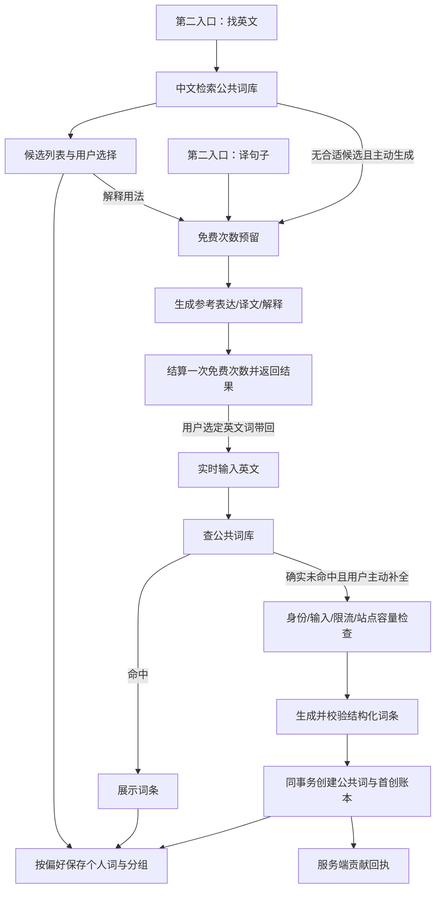

# 翻译体验重新设计：实时查词与补充查询

日期：2026-10-02（Asia/Shanghai）

状态：设计方案、交互原型与代码第一阶段接入；共享生成保护、行内用法解释/参考表达等仍未完成。本文件不代表完整实现、上线或验收完成。

## 1. 设计依据与纠偏

用户最新明确的产品方向：

1. **实时翻译是主要入口**，既检索词库，也能由用户主动请求生成；公共词首次入库贡献从这条链路产生。
2. **第二入口补足实时翻译的缺口**，包括中文找英文、句子翻译及必要的用法解释。
3. 原来的“实时翻译 + 中文检索库 + AI 询问”有合理基础。生成等待较长，因此不能把 AI 能力放在产品中心、让每个操作都变成等待。
4. **用户免费试用，翻译和解释不再消耗学力。** 贡献值不用于支付。

之前把用户的批评理解成“中文检索与 AI 询问全部弃用”，继而准备拆除旧工作区，是错误理解。此前读取代码后尚未执行该拆除。需要替换的是本轮上线的“文本翻译优先、退回旧工作区”的体验。

本方案覆盖并取代 `remaining-todos-design.md` 中与之冲突的 T5 页面组织、D4 默认入口、AI 询问学力费用，以及贡献来源范围。D1 的首次有效入库、D2 的隐私规则、D3 的实时入口默认自动保存仍沿用。

## 2. 推荐方案：把两类翻译任务放在同一工作区

保留实时查词与补充查询两类任务，统一放在“翻译”页；AI 模型不作为顶层入口。

| 入口 | 主要任务 | 默认行为 | 主要结果 |
| --- | --- | --- | --- |
| 翻译页“实时翻译” | 输入英文词或短语，查到后学习 | 默认显示；先查公共库，未命中才显示可选补全 | 结构化词条、保存目的地、保存状态；符合条件时的贡献回执 |
| 翻译页“补充翻译” | 中文找英文、翻译句子、理解具体用法 | 用户切换后进入；默认“找英文”，先显示词库结果 | 可比较的英文候选或句子译文；按需展开用法解释 |

第二入口使用两个任务选项：**找英文 / 译句子**。原有 AI 询问能力下沉到结果旁的“解释用法”“比较这些表达”，并保留低权重的“其他英语问题”入口。它不再与快速查词并列为醒目的 AI 主入口。

### 2.1 实时翻译：保留主要工作流

- 翻译页默认打开实时翻译，以输入英文为主；自动查库不自动生成。
- 每行清楚区分词库命中、正在查库、查库失败、确实未命中、正在补全。
- 查库命中：显示释义与已有例句；个人保存遵照“我的”中的自动保存开关，默认开启。自动保存倒计时可取消，目的地明确。
- 未命中：先提示检查拼写，再给普通样式的“补全词条”；用户点按后直接发起，不自动请求。处理时只显示轻量状态，不编造等待时间。
- 批量补全先列出本次实际缺词数；已有词不重复生成。停止排队后已完成的数据保留，未启动项不再发送。
- 中文输入或句子：保留输入，提示切换到“找英文 / 译句子”。切换只保留草稿，不自动提交。
- 贡献只在服务端确认公共词与账本提交后显示；“生成成功”“个人保存成功”“贡献 +1”是三个不同结果。

### 2.2 找英文：先有候选，再按需深入

默认状态是紧凑查询框，例如“提高”，主按钮为“查词库”。不展示大对话框、模型名称或大面积生成空白。

查询结果先展示 3–5 个可比较候选，每项含英文、词性、中文释义、匹配方式。可展开现有例句、播放读音、选择目标生词本后加入。更多候选按完整总数分页或展开。

候选顺序先依据完整释义/释义片段匹配，再依据可验证的匹配信息。`qualityScore` 仅表示现有字段完整度，不能冒充语义相关度或“最佳翻译”。缺例句就显示缺失，不伪造词库内容。

候选可能对应不同含义；“提高”可出现 improve、increase、enhance。页面只引用词库实际释义，不在查库阶段冒充已经理解了上下文。用户可输入更具体的中文；“解释用法/比较表达”是独立、明确触发的生成操作。

边界处理：

| 输入或结果 | 页面行为 |
| --- | --- |
| 中文词/短语 | 查库，保留完整原输入，默认不调用模型 |
| 多个中文词 | 明确“一行一个”，保留现有最多 20 行上限，不静默截断 |
| 句子或含重要数字/英文的混合内容 | 建议“译句子”，不删除字符后假装进行了完整查询；仍允许用户明确只查某个词 |
| 英文词/短语 | 提供“去实时翻译”，携带草稿但不自动查询 |
| 查库成功但无候选 | 改词提示；提供“生成参考表达”入口，点按后直接提交 |
| 查库网络失败 | 显示“重试查库”；不能伪装成未命中并诱导生成 |

**查询候选不自动加入个人库**，即使实时入口自动保存开启。候选有多义性，用户必须选定词条；“加入生词本”是这个选择本身，不需要再叠加同义确认弹窗。

对生成的参考英文，只提供复制与“去实时翻译查这个词”。该操作只预填草稿；不存在于公共库的词必须经过实时词条校验与显式补全，才能新建公共词和产生贡献。不能把整段回答拆成词后自动刷贡献。

### 2.3 译句子：明确触发，控制等待

- 同页切换到“译句子”，沿用输入位置，保留两个任务各自的草稿。
- 原文在前、译文在后；桌面宽屏并排，手机纵向排列。只承诺中英互译，混合文本由用户明确选择方向；方向选择需服务端支持后才上线。
- 默认忠实翻译。润色放在“表达选项”里，默认关闭，并说明可能改写表达。
- 主按钮“翻译句子”，用户点按即提交；不显示次数、剩余量或计费说明。处理中呈现轻量状态。
- 生成过程中原文与已有结果保持可读，允许停止。结果可以复制；整句不进入公共单词库，不计贡献，不因为实时入口自动保存开启而被保存为 Word。
- 选中译文中的英文词后可“去实时翻译学习”；导航本身不生成、不计贡献。
- 现有 `/api/translate-only` 是非流式返回。不能把动画打字当作真正的流式，也不能声称当前已经有后台任务或断线恢复能力。

### 2.4 用法解释：保留能力，降低存在感

“解释用法”位于单个候选展开区，“比较表达”位于用户选定的候选下方；上下文清楚后才提交。结果以局部抽屉/结果区呈现，避免跳进全屏聊天再绕回查词。

需要自由提问时使用低权重“其他英语问题”，继续保留原有问答与词库操作能力；所有写入提议仍需用户确认。已有词加入分组不产生公共新词贡献，回答中的文字也不直接写库。

解释和问答不扣学力，移除 spendPower/refundPower 的执行路径。用户界面不提示免费、额度、剩余次数或学力扣费，直接提供操作入口；请求处理中仅显示轻量状态。

## 3. 延迟与状态规范

先完成快路径，再提供慢路径；不把“中文找英文”包成一次模型调用。

| 场景 | 即时反馈 | 后续状态 | 用户可以做什么 |
| --- | --- | --- | --- |
| 词库查询 | 保留输入、标明正在查询 | 结果/无结果/查询失败 | 改词、重查；过期结果不得覆盖新输入 |
| 生成请求提交 | 接受请求后显示当前任务，禁止同一任务重复提交 | 处理中，真实内容到达后再显示 | 看已有候选、停止本次 |
| 等待较长 | 显示已等待时间，不编造剩余时间 | “仍在处理，可以继续查看已有结果” | 只在具备可恢复任务能力后允许切页后继续 |
| 网络中断 | 保留原文与已收到内容 | 查询原请求状态 | “恢复本次”，不能静默新建付费/计次任务 |
| 用户修改输入 | 新输入版本与旧任务区分 | 旧结果标记为对应旧原文 | 手动重新生成；旧任务不能自动保存新输入 |
| 取消与完成相撞 | 显示服务端最终状态 | 已取消 / 已完成并计次 / 核对中 | 不凭客户端 abort 宣称未计次或未入库 |

上线前采集词库响应时间、生成首内容时间、完成时间、失败率与取消率。设计阶段没有真实延迟测量，原型中的等待只演示状态，不代表模型速度。

## 4. 四种对象必须分开

| 对象 | 含义 | 谁能改变 | 与其他对象的关系 |
| --- | --- | --- | --- |
| 公共词条 PublicWord | 所有人复用的结构化词内容 | 实时入口合格首次生成、管理员维护、显式系统导入 | 句子/问答不直接写这里；更新现有词不是新增贡献 |
| 个人词条 Word + 分组 | 用户选择学习的词、学习进度和分组 | 实时自动/手动保存、候选选择、明确确认的词库工具操作 | 保存已有公共词不是公共首创；学习统计不能被覆盖 |
| 贡献账本 ContributionLedger | 首次有效公共词入库的归属证据 | 合格实时请求的事务写入，管理员有理由的作废/恢复 | 排名由有效账本计算，不能从个人词数/请求次数推算 |
| 后台试用保护/站点配额 | 生成服务的使用限制 | 服务端预留、结算和管理员配置 | 不兑换贡献、不扣学力；仅在后台记录，不在用户界面展示计数 |

## 5. 完整行为矩阵

“后台使用保护”列是服务端策略。生成不是查库的隐式副作用；用户点击生成入口即可发起。

| 动作 | 公共库写入 | 个人库写入 | 贡献 | 后台统计与学力 | 管理端证据 |
| --- | --- | --- | --- | --- | --- |
| 实时查库命中 | 无 | 按自动保存偏好或手动保存 | 0 | 无生成次数、无学力 | 查库事件、个人保存结果 |
| 实时补全首次有效词 | 新建，并与贡献账本同事务 | 按偏好；失败可单独重试 | 首次唯一成功者 +1，T0/来源规则通过后有效 | 沿用实时站点生成容量及限流，无学力 | 请求→公共词→账本→个人保存回执 |
| 实时查到现有词后补充字段 | 更新已存在词，受版本/质量规则约束 | 正常关联，不重置复习数据 | 0 | 同实时补全规则 | 更新前后值与版本 |
| 中文查库 | 无 | 只保存用户明确选择的候选 | 0 | 无 | 查库来源与选词保存 |
| 生成参考表达 | 无 | 无；带单词回实时入口另查 | 0 | 后台成功任务计 1 次 | 请求、结算、结果来源 |
| 句子翻译/主动润色再译 | 无 | 无 | 0 | 后台成功任务计 1 次；内部润色调用不重复扣用户次数 | 请求、模式、结算 |
| 用法解释/自由英语问题 | 无 | 工具提议经用户确认后只加入已有公共词 | 0 | 后台成功任务计 1 次，无学力 | 问答请求、确认操作、保存结果 |
| 管理员直接新建词 | 新建 | 仅关联/维护既有副本 | 0（管理来源占用唯一首创键） | 管理操作无用户生成消耗 | 管理员、原因、前后值 |
| 管理员编辑已有效词 | 更新 | 同步可见释义，保留进度与分组 | 原归属保留 | 无 | 版本与更正审计 |
| 确认无效词并停用 | 停用/隔离 | 保留用户学习记录，明确词条状态 | 原贡献作废 | 无 | 同事务停用与作废、原因、操作者 |
| 分享导入/系统迁移/修复 | 若需创建则明确相应系统来源 | 按原业务保存 | 0 | 不挤占用户试用次数 | 来源、批次、影响数量 |
| 删除个人词/取消收藏 | 无 | 删除个人关系，按既有规则处理分组 | 已有有效贡献不撤销 | 无 | 个人操作记录 |

管理员以普通用户身份使用实时入口时，按同样的首次规则计贡献；管理员直接维护接口不计贡献。不能单凭账号是否管理员决定来源。

## 6. 后台免费试用与服务保护

### 6.1 最新确认与推荐值

**已确认：所有翻译、参考表达、解释与英语问答都不再扣学力。** 学力继续用于原有学习/游戏功能；历史学力账目不因本次改版自动重算或退款。用户界面不展示“免费试用”“不消耗额度”、次数和剩余额度等说明，让用户直接查词与提交翻译。

后台使用策略建议（用户界面不展示以下次数或额度）：

- 词库查询与保存直接可用，不进入生成次数统计。
- 实时补全保留现有站点 API 池和每用户限流，不新增个人日额度。这是公共词积累主链路。
- 第二入口的参考表达、句子翻译、解释/问答，普通用户共用每日 30 次后台生成保护额度；每个成功的逻辑任务算 1 次，内部工具轮次/重连/失败切换不重复计次。入口始终直接可点，不显示计数；达到限制时返回通用的暂不可处理提示与重试操作。
- 后台额度按北京时间自然日计算，任务开始时固定计量日期，跨午夜完成仍结算到原预留日期。
- 管理员在后台查看试用用量并配置上限；所有角色依然受服务商真实可用量与限流约束。
- 旧问答免费白名单不再改变学力扣费（该链路已取消）；可清理兼容字段，服务容量仍受后台保护。
- 现有自定义密钥仅覆盖文本翻译路径；在设置项说明密钥调用可能产生服务商费用，不在查询与翻译主流程反复展示额度。不得因为配置了文本密钥就假定实时补全和自由问答也已支持。

上述 30 次/日是后台保护上限建议，不向用户展示或当作产品卖点；管理员能在后台调整。它不扣学力，本轮没有执行额度迁移。

### 6.2 当前实现的差异与必须修改的地方

| 当前代码事实 | 改版要求 |
| --- | --- |
| 实时词条生成使用站点 API 池，并有每分钟限流 | 保留服务端保护；前端直接提供操作入口，不显示次数或额度状态 |
| 文本翻译接口先检查日额度、调用成功后单独递增 | 后台改为原子预留与最终结算；界面隐藏用量计数，拒绝时提供通用重试提示 |
| 问答接口普通用户先扣 10 学力，异常退款失败被吞掉后仍可显示已退回 | 移除学力扣款/退款链路，后台接入使用保护；旧请求收尾按旧账处理，不重复退款 |
| `withLlmFailover` 的站点配额计数与模型请求单位有关，流式请求建立后便可能记录使用 | 保留真实服务商调用记录；不要把站点内部单位当作 Token、货币或用户剩余次数 |
| 文本用量接口未根据自定义密钥返回实际计费模式 | 仅管理端读取 policy、remaining、exemptReason；用户主界面不取用、不展示计数 |

## 7. 请求、入库和计次的执行顺序

使用有限的操作类型：`REALTIME_WORD`、`EXPRESSION_LOOKUP`、`EXPRESSION_GENERATE`、`SENTENCE_TRANSLATE`、`EXPLAIN`。来源由服务端处理链路确定；客户端传来的 `source=REALTIME`、Referer 或可改的标签都不是贡献证明。直接合法调用实时接口属于同一业务操作，不声称能证明用户点击过某个页面。

每次生成使用用户范围内唯一的 requestId 和请求内容指纹。同一个 ID 重连取原任务；同一 ID 换内容拒绝。改文、主动重新生成才创建新 ID。

必须区分三种可独立失败的结果：

1. **生成结果**：结构校验通过、对应哪个请求与原输入。
2. **公共持久化与贡献**：publicWordId、created/updated/reused/failed、contributionId 与 credited/notEligible/alreadyExists/disabled。
3. **个人保存**：目标分组、saved/alreadySaved/notRequested/failed。

公共词和对应账本必须在同一事务内提交。个人保存可独立幂等重试；个人保存失败不能谎报公共入库失败，也不能再次调用模型。并发生成同一规范词时只认一次公共创建及首创键，其他请求读取最终公共结果，不二次归属。

规范键统一 NFKC、trim、lowercase；新增公共词也需使用一致规范键，不能只在贡献表规范化却让公共表保留重复变体。已有冲突先出迁移报告，不能静默合并个人学习记录。

生成词必须属于本次请求的英文词集合；校验类型、完整释义和词/短语边界，排除句子、错误占位、无效拼写响应。不能因为模型多输出一个词就顺带入库计贡献。字段完整度分数不等于语言正确，管理员仍可纠正或作废。

免费结算状态采用 `reserved / settled / released`，与生成的 `running / succeeded / failed / cancelled` 分开。失败只释放一次；完成与取消竞争以数据库最终状态为准。前端不能根据断线或“停止”按钮自行退款。

为重连保存必要任务状态与结算回执；若支持跨刷新取回句子译文，需要短期、仅本人可访问的结果缓存。推荐 24 小时自动清理并在产品说明中告知，不能把它默认为永久翻译历史，也不能把原文写入公共日志或 URL。这个能力应在实现任务恢复时一起交付。

## 8. 贡献来源、历史与隐私

现有 `source=USER_AI` 不能证明“来自实时入口”。在账本和生成记录中补充 `entryPoint`、`originRequestId`；本方案可计分条件为：`USER_AI + REALTIME_WORD + 首次规范词键 + VALID + 可信起始时间`。

中文查库、句子翻译、解释、保存已有词、管理维护和导入均不产生新的用户贡献。生成参考词被带回实时入口后，只有确实触发了合格首次词条创建才计分；导航或复制不计分。

历史策略：保存现有账本与未知来源占位，不把旧记录全标成实时来源，不重新计算历史作者。实施前导出现有有效/作废/未知/可核实来源数量和新规则影响；已公开的历史分数不能因新增字段默认值而被悄悄清零。可核实记录迁移来源；无法核实的保留原账证据与“历史来源待核实”状态，明确新规则起点。T0 未配置时 UI 不显示虚构的贡献增长。

继续默认仅本人可见；匿名/昵称参与公开榜单由本人选择。匿名榜单不暴露账号 ID、个人入库明细或原始请求。贡献按有效词条数计，不与学力、免费次数混算。

## 9. 管理员界面与词条生命周期

管理入口沿现有职责组织：

| 页面 | 改版内容 | 关键操作约束 |
| --- | --- | --- |
| `/public-words` 公共词管理 | 列表显示来源、有效状态、是否有贡献；详情联查贡献和受影响个人引用数 | 编辑保留原贡献归属、复习进度与分组；记录版本与审计 |
| 公共词管理中的“贡献审计”入口 | 补齐分页列表与详情，连接现有作废/恢复 API | 筛选来源/状态/用户/规范词/批次；操作说明前后分值与原因 |
| `/llm-config` | 站点服务商配额与调用记录 | 明确它不是个人免费次数；密钥继续脱敏 |
| `/admin/ai` | 改为“解释与生成使用记录”，呈现免费请求数、失败/取消与耗时；同页“试用设置”配置第二入口每日次数与操作范围 | 取消新请求学力费用列；历史学力消费标成历史账目；配置变更有生效日期与审计，不追溯改写已结算任务 |
| `/analytics`、`/translation-records` | 区分实时查库、中文查库、补全、句子、解释；支持请求定位 | 翻译查询数、个人收藏数、公共新增数、有效贡献数分别统计 |

具体规则：

- 正常编辑已有效词：保留首创者及贡献，记录修订人与修订内容，原有用户学习统计不变。
- 确认无效词：用“停用词条并作废贡献”作为一项有理由的事务操作。保留账本、个人学习记录及错误说明，停止将其作为有效词库命中。
- 合法词因管理原因退出公开展示：可归档并保留贡献，不能把所有管理删除都当作贡献作弊。
- 当前个人 Word 的释义多为 NULL，依靠 publicWordId 读取公共内容。**禁止先硬删公共词再让外键置空**，否则个人词可能失去释义。推荐词条停用/归档状态；若确需硬删，先落实个人内容快照与关联处理并核验。
- 删除后重建、规范词变体、重复导入均不得重新奖励同一首创键。词条合并需要独立的数据迁移步骤，不能把两个词的学习统计直接相加或覆盖。
- 贡献作废/恢复要做权限检查、CSRF 防护、理由校验、并发版本核对和同事务审计。恢复无效来源或未知历史归属不能使其自动上榜。

## 10. 代码证据与改动落点

以下是本轮本地代码审阅结果，不等于线上实测结果。

| 代码落点 | 当前事实 | 设计要求 |
| --- | --- | --- |
| `src/app/ai/page.tsx`、`TranslationWorkspace`、`ZhEnAssistant` | `/ai` 默认显示实时查词；可切换补充查询中的找英文/译句子，候选可预填实时输入；首页重复实时面板已移除 | 继续补齐候选旁行内解释、生成参考表达和上下文回带，不自动提交 |
| `src/hooks/useRealtimeTranslation.ts` | 查 `/api/public-translate`，未命中由用户触发 `/api/translate`，保存使用独立接口/偏好 | 保留这条主链；消费服务端持久化/贡献回执，不凭模型文本猜成功 |
| `src/app/api/public-translate/route.ts` | 命中写 TranslationRecord；事件目前统一记作 GUEST_TRANSLATE | 区分真实登录身份与入口；记录不能替代贡献证据 |
| `src/lib/zhEnLookup.ts` | 删除非汉字后 contains 匹配，先完整匹配；返回总数及 hasMore | 保留原输入语义，不把句子数字删掉当准确翻译；候选匹配与质量分区分 |
| `src/services/TranslationService.ts` | 流结束解析后先存公共词，再按 autoSave 存个人词；支持取消 | 加入请求约束校验、分步骤回执、失败恢复；保存失败不吞掉后伪报完成 |
| `src/services/PublicWordService.ts` | 公共创建与 USER_AI 账本同事务；更新已有词不新增账本 | 增加可信业务来源和请求关联；统一词键；持续保留事务唯一性 |
| `src/app/api/vocabulary/save/route.ts` | 已有公共词才可存个人，校验目标分组所属，upsert 不重置正确/错误数 | 作为已知候选个人保存入口，重复保存幂等 |
| `src/app/api/sync/route.ts` | 可直接写个人内容，未创建公共词或贡献 | 兼容现存调用；新的候选保存不绕到此接口制造伪公共词 |
| `src/services/AiAssistantService.ts` | 工具加入个人分组只接受现有公共词，缺词返回错误 | 保留确认式写入；新词引导回实时流程，不自动给解释工具开放公共写权限 |
| `src/app/api/translate-only/route.ts`、`src/lib/translateOnlyUsage.ts` | 系统 30 次/日，自定义密钥另走，非流式；检查和递增分离 | 操作级免费策略、原子预留、幂等结算、明确方向与忠实提示词 |
| `src/app/api/ai/ask/route.ts` | 已移除学力扣款/退款，问答记录写入 cost=0；仍只有原每分钟限流，未并入文本翻译的每日额度保护 | 保留历史账目；补齐服务端共享日额度预留/结算及并发、取消与失败恢复 |
| `src/lib/llmPool.ts`、`src/app/api/llm-providers/route.ts` | 服务商内部配额；先读余额再写新余额的并发边界需核查 | 站点配额更新原子化，审计实际尝试；不拿该余额当用户免费次数 |
| `src/app/api/contributions/*`、`src/lib/contributionLedger.ts` | USER_AI/VALID/T0 筛选，缺少入口字段 | 来源可核验、历史切换报告、本人明细和榜单一致 |
| `src/app/api/admin/contributions/[id]/route.ts` | 已有作废/恢复 PATCH；未发现前端管理入口或管理员列表 API | 一起交付管理员入口、查询与审计，不把单个 API 当功能完成 |
| `src/app/api/public-words/route.ts`、`src/lib/publicWordCascade.ts` | 管理删除硬删；个人内容依赖关联；编辑同步内容 | 停用/归档、引用保护、词条与贡献状态有理由地联动 |

## 11. 双端适配与现有项目接入

本方案同时覆盖电脑端和手机端，功能、请求与数据规则相同，布局跟随现有应用断点变化。原型顶部的“电脑端 / 手机端”仅用于评审时切换预览，实际产品不增加设备切换按钮。

| 范围 | 当前项目位置 | 接入方式 |
| --- | --- | --- |
| 应用外壳 | AppLayout、AppSidebar、MobileNavBar | 继续由 AppLayout 提供导航。电脑端沿用左侧栏；手机端沿用底部“首页 / 复习 / 翻译 / 我的”。翻译页内不再嵌一套应用导航。当前 xl 是电脑侧栏与手机底栏的切换断点。 |
| 翻译页主入口 | 现有 /ai 路由的 AiPage、TranslationWorkspace、WordTranslationPanel、useRealtimeTranslation | 保留 URL 和 AppLayout；页面默认呈现实时翻译，复用现有查公共词、按需补全、保存与贡献链路。首页不再嵌入重复面板，导航入口直接打开翻译页。 |
| 补充查询入口 | 同一 TranslationWorkspace、ZhEnAssistant | 页面内切换到“补充翻译”，再选“找英文 / 译句子”；AI 问答作为“其他英语问题”次级入口。切换时保留实时输入和补充查询状态，不新增顶层导航，也不把 AI 模型做成页面。 |
| 中文词库查询与保存 | ZhEnAssistant、/api/zh-to-en、review-groups API | 沿用查询与分组保存服务；候选查询不自动收藏，用户选定后再加入目标生词本。 |
| 句子与问答 | /api/translate-only、AiAssistant、/api/ai/ask | 复用既有服务与工具权限；翻译方向、学力记账和服务保护由服务端处理。前端不拉取个人使用量、不显示计数。 |
| 公共入库与贡献 | 翻译页实时补全、TranslationService、PublicWordService、ContributionLedger | 仅由实时首次有效入库记用户贡献。补充查询、句子与问答不直接写公共库；需要学习某个英文词时，由用户切回实时翻译发起查词/补全。 |
| 管理与分析 | /public-words、贡献管理、/admin/ai、/analytics | 继续在管理端查看来源、使用记录和服务商用量；这些管理信息不进入普通用户页面。 |

### 11.1 电脑端

使用现有 240px 侧栏和主内容区。中文候选保持单列、宽松行高；释义和加入生词本是第一层信息，例句按需展开，用法解释放在候选的次级操作。句子页可在宽屏把原文与译文并列，但仍由同一个任务表单发起。

### 11.2 手机端

使用现有底部导航，不显示桌面侧栏或第二套页面导航。输入框、任务切换和候选列表纵向排列；候选仍先显示英文与中文释义，例句折叠，解释贴近候选。底栏高度和安全区由现有 MobileNavBar 负责，不在页面里重复固定导航。

### 11.3 共同交互

- 翻译页默认“实时翻译”；切换到“补充翻译”后，可在“找英文 / 译句子”间切换并保留输入状态。
- 实时翻译和补充查询共用一个页面与应用外壳；切换入口不自动提交另一个任务的输入。
- 只有用户在实时入口发起查词/补全才触发相应公共词读写与贡献链路。
- 用户界面不显示免费次数、剩余额度或学力提示。后台调用限制与管理员记录继续执行。
- 中文输入法组合期间 Enter 不提交；单词模式 Enter 查库，句子模式 Enter 换行，Ctrl/Cmd+Enter 提交。
- 页面沿用现有品牌色与主题。输入至少 16px，触控目标至少 44px，页面不制造独立滚动容器；模式切换保留原文。

## 12. 分阶段实施与验收

实施前保留当前工作区改动并生成源码/数据基线。按下列顺序交付，禁止把全部链路一次性换掉再靠生产反馈找错。

| 阶段 | 工作包 | 完成证据 |
| --- | --- | --- |
| A 产品与记录契约 | 双端入口职责、现有路由/组件接入图、写入/学力/后台保护规则 | 用户任务明确；原应用导航不重复；数据与后台保护矩阵没有未定义分支 |
| B 免费请求与回执 | 请求 ID、状态、免费池预留/结算；问答去学力；站点配额与个人额度区分 | 并发、取消、失败、重连、跨日不多扣；学力余额完全不变 |
| C 实时与贡献 | 来源字段、规范键、持久化回执、历史兼容；保留自动保存规则 | 首创唯一、缓存不计分、保存失败可重试、榜单归属可追溯 |
| D 管理与生命周期 | 贡献管理 UI、停用/归档、引用保护、审计 | 管理员能从词条追到请求和贡献；停用不丢个人学习数据 |
| E 补充页体验 | 找英文默认、候选比较、译句子、局部解释、跨入口草稿 | 普通用户可不调用生成完成中文查词；慢请求不覆盖快结果 |
| F 验证与发布 | 矩阵回归、样例评审、移动操作、版本/备份/磁盘检查 | 本地/生产各自记录结果；符合条件后才勾待办 |

关键验收用例：

1. 英文词库命中，自动保存开/关分别符合设置；无模型调用、无贡献增长。
2. 同词已在个人库但不在目标分组，只增加分组关系，学习统计不重置。
3. 两用户并发补全同一新词，只有一个首创归属；另一个仍能正常保存公共结果。
4. 全角/大小写/空格规范变体不能重复贡献，已有冲突迁移有明确报告。
5. 模型返回不在请求内的词、句子或错误占位，不写公共库、不计贡献。
6. 公共提交成功而个人保存失败，两种状态准确；重试保存不生成、不新计分。
7. 自动保存关闭时仍可按确认规则产生公共首创；个人库保持未保存状态。
8. 查中文候选不调用模型，不自动收藏全部候选；选择一个词再保存。
9. 中文混合数字/英文或句子不被静默删字；切换任务保留原文。
10. 查库断网与查库无结果不同，失败不自动转成生成请求。
11. 参考表达、句子、解释都不写公共词、不计贡献；带词回实时入口只填草稿。
12. 句子保留数字、否定、专名、段落；润色默认关闭且说明改写。
13. 普通用户完成问答，学力余额/学力流水没有扣款或退款；后台成功使用仅记一次。
14. 同一 requestId 重试不重复生成/结算；换内容复用 ID 被拒绝。
15. 只剩一次免费机会，两标签并发最多一个成功预留；失败释放一次。
16. 午夜前预留、午夜后成功/失败按原日期结算，不占新一天两次。
17. 取消与提交竞争、断线后恢复、切换账号，状态与权限正确；旧结果不覆盖新输入。
18. 管理员、自定义文本密钥、旧问答白名单对应后台保护策略正确，不能由客户端伪造豁免；用户操作界面不显示次数与额度。
19. 管理员更正有效词保留首创；确认无效停用与作废同事务，恢复有原因和权限验证。
20. 停用/归档公共词后，原个人词与学习统计仍可解释；无 NULL 释义造成的空卡片。
21. 删除再建、管理员新增、分享导入、系统脚本、收藏及查询记录均不刷用户贡献。
22. 默认私密/匿名/昵称、T0 未启用、历史来源待核实等状态正确，管理员记录不在公开榜泄露。
23. 24 个固定样例：英文单词/短语 6、中文多义/混合 6、中英句段 8、异常/重试 4；保存输入、结果和人工判定，数字/否定/专名错误作为阻断项。
24. 390px 与 1440px 完整操作两入口；真实设备补查软键盘、返回、断线和 App 壳，不以桌面模拟视口代替真机结论。

本轮产物为设计文档与示例交互原型。真实额度配置、历史贡献迁移影响和模型延迟需要实施前核验；以上推荐规则没有写入生产数据。
