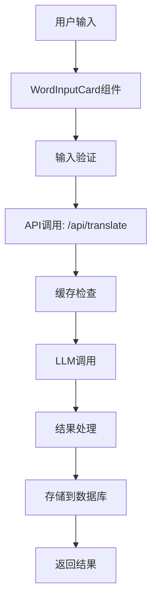
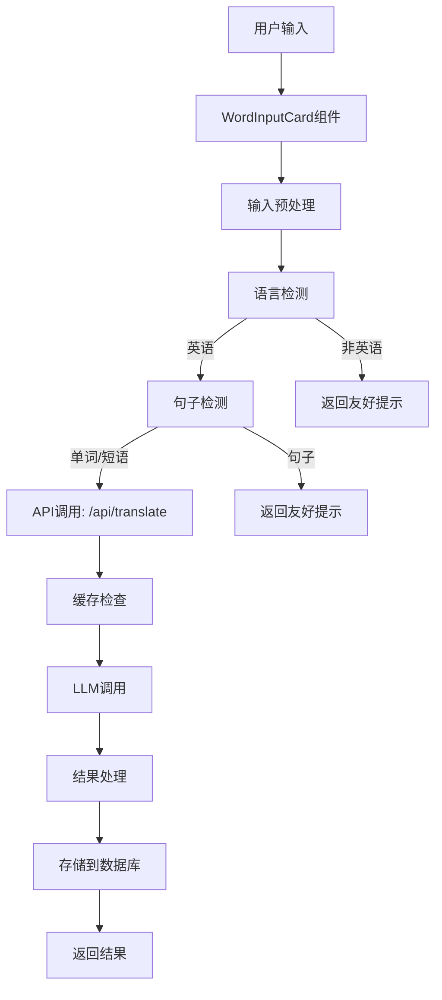
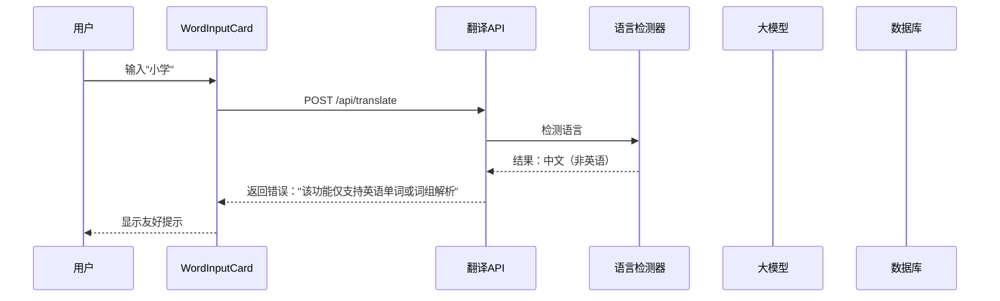
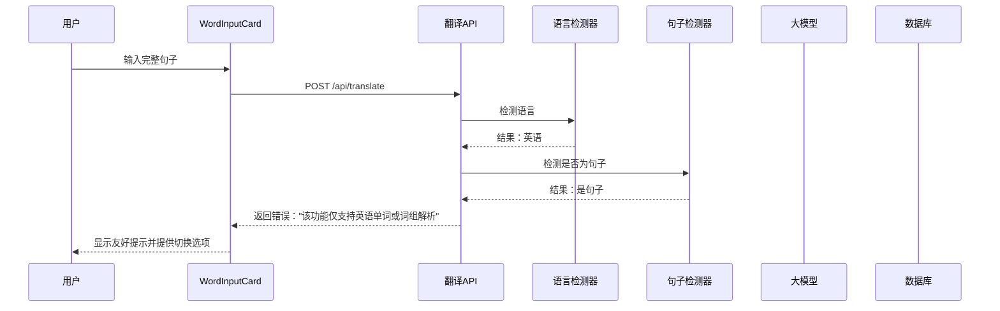
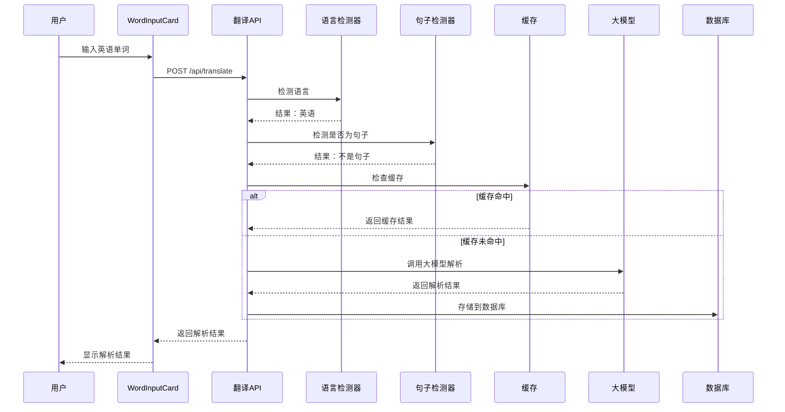

# 翻译项目技术开发文档

## 1. 问题分析摘要

### 1.1 问题一：非英语输入处理问题
- **现象**：用户输入中文词汇"小学"时，系统返回`n.[C]小学`的解析结果，错误地为中文词汇添加英语词性标记
- **根本原因**：
  - 系统提示词存在矛盾指令（英语词典助手 vs 待翻译文本处理）
  - 缺乏语言检测机制，非英语输入被错误传入大模型
  - 输入验证不足，没有在调用大模型前验证输入语言
  - 错误处理不当，没有对非英语输入给出明确友好提示

### 1.2 问题二：句子输入处理问题
- **现象**：用户输入完整句子"what should people do to make their visit new york city safe and pleasant"时，系统将其当作单词处理并存储到公共单词库
- **根本原因**：
  - 输入验证缺失，没有区分单词、短语和完整句子
  - 存储逻辑问题，完整句子被存储到公共单词库
  - 大模型处理问题，没有明确区分单词、短语和句子的处理方式
  - 用户体验问题，功能区分不明确，缺乏引导

## 2. 技术架构说明

### 2.1 当前架构


### 2.2 改进架构


## 3. 接口规范

### 3.1 现有接口
- **POST /api/translate**：处理单词解析请求
  - 请求体：`{ "words": string[], "options": { "showPos": boolean, "showExample": boolean }, "targetGroupId": string }`
  - 响应：流式返回解析结果

### 3.2 新增接口/修改
- **修改 POST /api/translate**：
  - 添加语言检测和句子检测逻辑
  - 非英语输入或句子输入直接返回错误提示
  - 请求体保持不变
  - 响应：添加错误码和错误消息

- **新增 POST /api/translate/detect**（可选）：
  - 用途：预检测输入语言和类型
  - 请求体：`{ "text": string }`
  - 响应：`{ "language": string, "type": "word" | "phrase" | "sentence" }`

## 4. 数据流程设计

### 4.1 非英语输入处理流程


### 4.2 句子输入处理流程


### 4.3 正常单词处理流程


## 5. 错误处理机制

### 5.1 错误类型
| 错误类型 | 错误码 | 错误消息 | 处理方式 |
|---------|--------|---------|---------|
| 非英语输入 | 400 | 该功能仅支持英语单词或词组解析 | 直接返回友好提示 |
| 句子输入 | 400 | 该功能仅支持英语单词或词组解析 | 直接返回友好提示 |
| 输入为空 | 400 | 输入不能为空 | 前端验证 |
| 输入过长 | 400 | 输入长度超过限制 | 前端验证 |
| 系统错误 | 500 | 系统内部错误 | 记录日志，返回通用错误 |
| API配额用尽 | 503 | API额度用尽 | 返回配额用尽提示 |

### 5.2 错误处理流程
1. **前端错误处理**：
   - 输入验证：检查空输入、长度限制
   - 语言检测：预检测输入语言
   - 错误提示：显示友好的错误消息

2. **后端错误处理**：
   - 输入验证：检查输入格式、长度
   - 语言检测：验证是否为英语
   - 句子检测：验证是否为句子
   - 错误返回：返回标准错误格式

## 6. 性能优化策略

### 6.1 语言检测优化
- **轻量级语言检测**：使用基于字符集和常见单词的轻量级检测算法
- **缓存检测结果**：缓存常见输入的语言检测结果
- **批量检测**：对多个输入进行批量检测，减少重复计算

### 6.2 输入验证优化
- **前端验证**：在前端进行初步验证，减少无效请求
- **预检测**：在用户输入时进行实时预检测
- **节流处理**：对输入检测进行节流，避免频繁检测

### 6.3 存储优化
- **公共库过滤**：严格过滤存储到公共库的内容
- **质量评分**：优化质量评分算法，确保只有高质量的英语单词和短语被存储
- **批量存储**：对多个单词的存储操作进行批量处理

### 6.4 大模型调用优化
- **输入过滤**：在调用大模型前进行严格的输入过滤
- **缓存策略**：优化缓存策略，减少重复调用
- **批量处理**：对多个单词进行批量处理，提高效率

## 7. 技术实现细节

### 7.1 语言检测实现
- **方案**：使用 `franc` 或 `langdetect` 库进行语言检测
- **配置**：
  - 支持的语言：主要检测英语，其他语言视为非英语
  - 置信度阈值：设置合理的置信度阈值，避免误判
- **集成方式**：
  ```typescript
  // src/lib/languageDetector.ts
  import franc from 'franc';
  
  export function detectLanguage(text: string): { language: string; isEnglish: boolean } {
    const language = franc(text, { only: ['eng', 'cmn', 'spa', 'fra', 'deu'] });
    return {
      language,
      isEnglish: language === 'eng'
    };
  }
  ```

### 7.2 句子检测实现
- **方案**：基于长度、标点符号和词数的启发式检测
- **规则**：
  - 长度超过50个字符
  - 包含多个空格（超过3个）
  - 包含标点符号（句号、问号、感叹号）
  - 词数超过10个
- **实现**：
  ```typescript
  // src/lib/sentenceDetector.ts
  export function isSentence(text: string): boolean {
    const trimmed = text.trim();
    const wordCount = trimmed.split(/\s+/).length;
    const hasPunctuation = /[.!?]/.test(trimmed);
    const hasMultipleSpaces = trimmed.split(/\s+/).length > 3;
    const isLong = trimmed.length > 50;
    
    return wordCount > 10 || (hasPunctuation && (hasMultipleSpaces || isLong));
  }
  ```

### 7.3 输入验证实现
- **修改 WordInputCard 组件**：
  - 添加实时输入检测
  - 显示输入类型提示
  - 提供功能切换按钮

- **修改翻译 API**：
  - 在 `/src/app/api/translate/route.ts` 中添加语言检测和句子检测
  - 对非英语输入或句子输入直接返回错误

### 7.4 存储控制实现
- **修改公共库存储逻辑**：
  - 在 `calculateQualityScore` 函数中添加句子检测
  - 降低句子的质量评分
  - 限制存储到公共库的内容长度

### 7.5 提示词结构优化
- **更新系统提示词**：
  - 明确处理非英语输入和句子输入的规则
  - 确保大模型能够正确识别和处理不同类型的输入
  - 消除提示词中的矛盾指令

## 8. 测试验证方法

### 8.1 单元测试
- **语言检测测试**：
  - 测试英语输入的检测
  - 测试非英语输入的检测
  - 测试边缘情况（混合语言）

- **句子检测测试**：
  - 测试单词输入的检测
  - 测试短语输入的检测
  - 测试句子输入的检测
  - 测试边缘情况（长短语）

- **输入验证测试**：
  - 测试空输入
  - 测试过长输入
  - 测试特殊字符输入

### 8.2 集成测试
- **API 测试**：
  - 测试非英语输入的处理
  - 测试句子输入的处理
  - 测试正常单词输入的处理
  - 测试错误处理

- **UI 测试**：
  - 测试输入检测提示
  - 测试错误提示显示
  - 测试功能切换按钮
  - 测试用户引导流程

### 8.3 性能测试
- **响应时间测试**：
  - 测试语言检测的响应时间
  - 测试句子检测的响应时间
  - 测试整体 API 响应时间

- **负载测试**：
  - 测试并发请求处理
  - 测试批量输入处理
  - 测试缓存性能

## 9. 实施步骤

### 9.1 阶段一：基础设施搭建
1. **添加依赖**：安装语言检测库
2. **创建检测模块**：实现语言检测和句子检测功能
3. **修改 API 路由**：添加输入验证逻辑

### 9.2 阶段二：核心功能实现
1. **修改 WordInputCard**：添加实时输入检测和提示
2. **修改翻译 API**：添加语言检测和句子检测
3. **优化存储逻辑**：限制公共库存储
4. **更新提示词结构**：消除矛盾指令，明确处理规则

### 9.3 阶段三：用户体验改进
1. **添加功能引导**：在 UI 上明确功能区分
2. **优化错误提示**：提供友好的错误消息
3. **添加功能切换**：在检测到句子时提供切换选项

### 9.4 阶段四：测试与优化
1. **单元测试**：测试各个模块的功能
2. **集成测试**：测试整体流程
3. **性能测试**：测试系统性能
4. **优化调整**：根据测试结果进行优化

## 10. 技术约束条件

### 10.1 依赖约束
- **语言检测库**：需要添加轻量级语言检测库
- **性能要求**：语言检测和句子检测必须在 100ms 内完成
- **准确性要求**：语言检测准确率需达到 95% 以上

### 10.2 系统约束
- **兼容性**：修改必须兼容现有 API 格式
- **向后兼容**：确保现有功能不受影响
- **可扩展性**：设计应考虑未来可能的语言支持扩展

### 10.3 安全约束
- **输入验证**：必须对所有输入进行严格验证
- **错误处理**：不得在错误消息中泄露系统信息
- **速率限制**：保持现有的速率限制机制

## 11. 结论

本技术开发文档详细阐述了翻译项目中已识别问题的技术实现细节、解决方案设计思路、具体实施步骤及技术约束条件。通过添加语言检测、句子检测、优化存储策略、更新提示词结构和改进用户界面，可以有效解决非英语输入处理和句子输入处理的问题，提高系统的专业性和用户体验。

实施本方案后，系统将能够：
- 正确识别和处理非英语输入，给出友好提示
- 正确识别和处理句子输入，引导用户使用合适的功能
- 保持公共单词库的高质量，只存储真正的英语单词和短语
- 提供更加清晰、专业的用户体验
- 消除提示词中的矛盾指令，确保大模型处理的一致性

技术团队可以按照本文档的实施步骤逐步推进，确保解决方案的顺利实施。